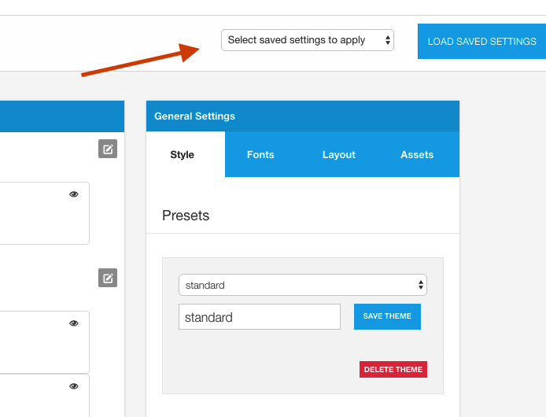

There are three main components of a Zen Grid Framework v5 theme and it's important to understand their relationship when you are working with the themes.

In brief:

- Config files hold template settings and layout data for an instance of the template.
- Theme files contain display data and are primarily used in the processing of less files via the template admin
- Layout files are used only as sample layouts to load int he layout interface. The layout data used by the front end of the template are stored in the config file.

## Config files

Configuration files are the files referenced by specific instances of a template.

In Joomla each template is given an id in the database. ZGFv5 themes attach the configuration for each instance of a template to a configuration file that is named on the server in the following format:

	config-78.json

In the example above the number 78 refers to the id of the template. This id can be seen in the template manager in the id column as per the screenshot below. The number 78 in this instance refers to the Two right sidebar instance of the template.

The config file is the key to unlocking the configuration of the template. It is a simple two level json object that stores the template params and layout data:

**Parameter object**

	{
	  "params":{
	    "theme":"xero",
	    "panel_trigger_text":"Open Panel",
	    "social_position":"relative",
	    "social_position_align":"align-left",
	    "social_style":"social-square",
	    "social_mobile_position":"fixed-right",
	    "social_mobile_position_align":"align-left",
	    "social_mobile_style":"social-no-style",
	    "use_font_loader":"0",
	    "use_typekit":"0",
	    "typekit_id":"",
	    "bodyfont":"-1" ...

**Layout object**

	"layout":{
	   "top":{
	     "positions":{
	       "top4":"12"
	     },
	     "classes":{
	       "classes":"no-change-phones  row-padding-vert-sml row-margin-none container-padding-none container-margin-none"
	     }
	   },
	   "logo":{
	     "positions":{
	       "logo":"6",
	       "search":"6",
	       "social":"12"
	     },
	     "classes":{
	       "classes":" row-padding-vert-sml container-padding-none"
	     }
	   } ...
	

#### Where are the config files stored?

User stored configuration files are located in the settings/config folder, while the presets that are shipped with the template are stored in the settings/config/config-sample folder.

The config-sample configuration files are example files that can be loaded by the user as a way to load the relevant data into the template to replicate the template style.

#### How do you load a configuration file?

The list of available configuration files available can be seen in the select box that sits in the toolbar above the sidepanel. Example configuration files are displayed with an [example]- prefix. While other user created configurations are shown using the name of the configuration that the template instance has been saved with eg buildr - frontpage

To load a specific configuration open the selectbox by clicking on it and selecting the configuration you would like to load. Then click the "Load Saved Settings" button. Once the button has been clicked the theme and layout data for the configuration is loaded into the interface.

## Theme Files

Theme files contain data relating specifically to the visual display of the site. 

Each theme is stored in json format using three groups of objects: settings, colors and files:

Settings (any parameter that isn't set by using the color picker): 

	{
	  "settings":{
	    "twidth":"980px",
	    "base-padding":"30px",
	    "gutter-pc":"2%",
	    "containershadow":"0 0 0 1px rgba(0, 0, 0, 0.06), 0 3px 8px rgba(0, 0, 0, 0.06)",
	    "wrap-overlay-fade":"40%",
	    "wrap-overlay-height":"100%" ...

The color object (all items set via the color picker):

	"colors":{
	    "primary":"96CA2D",
	    "secondary":"3B424C",
	    "border-color":"eeeeee",
	    "text-color":"ffffff",
	    "heading-color":"eeeeee",
	    "spotlight-bg":"none",
	    "link-color":"@primary",

The file object stores any relevant files required by the theme such as bootstrap2 files or less files specified in the settings panel.

	"files":{
	  "framework_files":"",
	  "custom_less":""
	},
	
Theme data can be reused within various configurations you may have on your site.

The theme used by a specific configuration is determined by the theme item in the configuration object.

	{
	  "params":{
	    "theme":"revision" ...

#### Where are the theme files stored?

User created theme files are stored in the settings/themes folder while theme presets that are shipped with the template are stored in the settings/themes/presets folder.

#### How to load a preset

Please see the <a href="../style/loading-presets">How to load a preset page</a> for an explanation on how to do this.
	
## Layout Files

Layout data is stored in the configuration file, however predefined layouts and user created layouts can be loaded and saved via the interface. 

The final layout data used by the template is stored in the appropriate configuration file for that template style, while layout presets are stored in the settings/layout folder.

Please see the <a href="../layout/loading-layouts">loading layout page</a> for an explanation on how to do this.

#### Where are layout files stored

Both user generated and preset layouts are stored in the settings/layout file.
