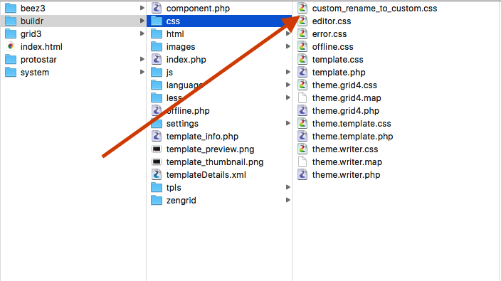
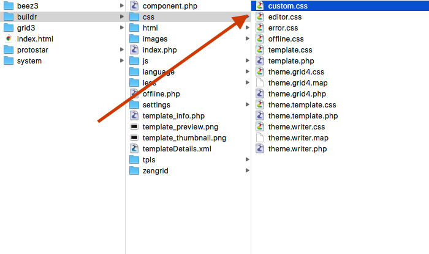
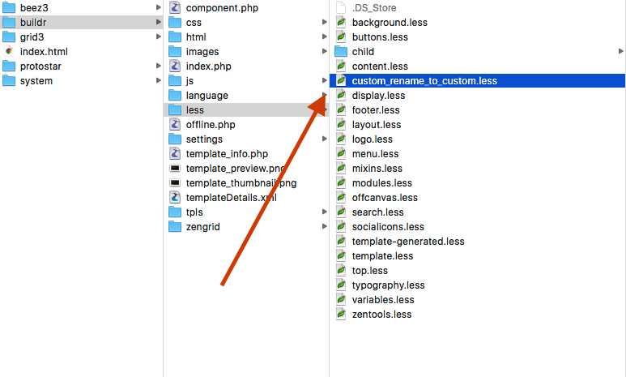
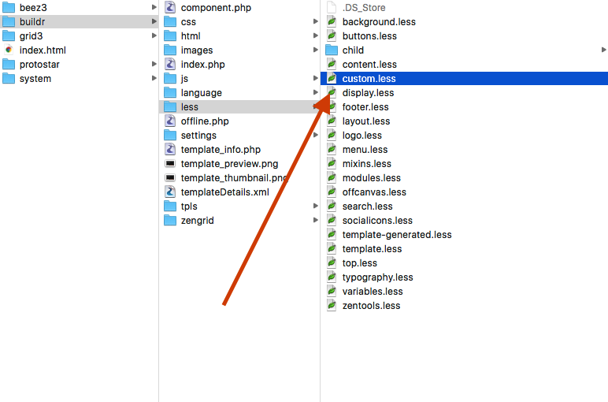

There are a number of different ways to customise the Build.r template. The workflow you choose will depend on your skill level and the way that you prefer to work.

Editing and creating themes using the template settings.
----

The easiest way to modify or create a new theme is via the template settings. In the template administrator go to the theme panel and select the theme from the drop down you wish to use as a base for your new theme.

Selecting an option from the list of themes will automatically load the settings from that theme in the settings below.

Once you have chosen your base theme enter the name of your new theme in the save theme input box and then click save. Once you have clicked save, **any further saved changes to your theme will be saved to your new theme file in the settings/themes folder of the template**.

After saving your new theme name you can then go through the settings available in the template admin and make the required changes to the template colours, spacing etc.

For a full description of the available settings available for controlling the way your website looks please ensure you read through the <a href="../style">style section of the documentation</a>.

After you have finished making your changes click the save theme button at the top of the theme panel in order to save the new settings and then compile the theme to a css file.

> The css file that is compiled will be named according to the name assigned to your theme - eg css/theme.my-new-theme-name.css.

Using custom.css to make small changes
----

If you are happy to use one of the default themes without making too many broad changes it is possible to add small changes to your theme in a file called css/custom.css.

The template comes with a file called custom_rename_to_custom.css file which after you rename to custom.css file it will be loaded by the template. The custom.css file is loaded after all other css files and will automatically override any existing css style if the correct specificity is used.

Using custom.less files to use with the less compiler.
----

Another option for making changes to a theme involves the use of a less/custom.less file. If this file exists in the less folder the template's compile will automatically compile any less found in this file to your themes css when the compile less button is  clicked.

Any variables included in the less/variables.less file or set in the template administrator are available in the custom.less file. It is also possible to use any template mixins here as well.

The custom.less file will not be overwritten during a template update using the Joomla installer.

Adding other files to the compiler
----
It is also possible to include other less files in the template's compiler. These files will be compiled to css after clicking the compile less button and included in the theme's css file. To add files to the compiler go to the settings panel in the administrator and scroll down to the area marked "Add less files to compiler".

An example of using this option might be wanting to compile the zentools.less into your template's css file in order to reduce the number of css files loaded in the browser. Zentools is our responsive gallery module and has an option to disable the loading of css files.

To include the zentools less files in the compiler you would simply add the following to the add to compiler text area media/mod_zentools/less/zentools.less.

Adding inline css to the head of your template
----

Another option for adding custom or extra css to your theme is to add it directly to the custom scripts area in the settings panel.

Any text entered here is output directly on the page so you need to add the entire snippet you want to include, including the style tags as per the example below:

	

this styling is best added to the before closing head option. 

Customisation Frequently Asked Questions
---
## Does custom.less work the same as custom.css?_

Adding changes to the custom.less or custom.css file more or less results in the same outcome - that is that your changes are applied to your site. However there are some things to consider before choosing which method suits you the most.

_Choosing to use a Choosing custom.less_

Benefits:
- The developer can use less syntax and variables while adding their customisations
- No extra files are added to the output of the site

Challenges:
- Each time a change is made to the file you will need to recompile less to css in the template admin
- Incorrect less syntax will cause the compiler in the template admin to fail

_Choosing to use a custom.css file_

Benefits:
- Changes are automatically added to the site without the need to compile less to css.

Challenges:
- An extra file (custom.css) is added to the output of your site. Even though your customisations are likely to be small adding another http request will impact the speed of the site.
- It's not possible to use less syntax including variables in your custom.css file.
