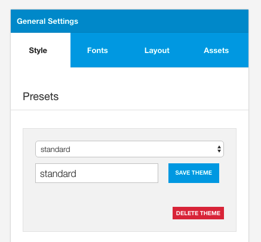
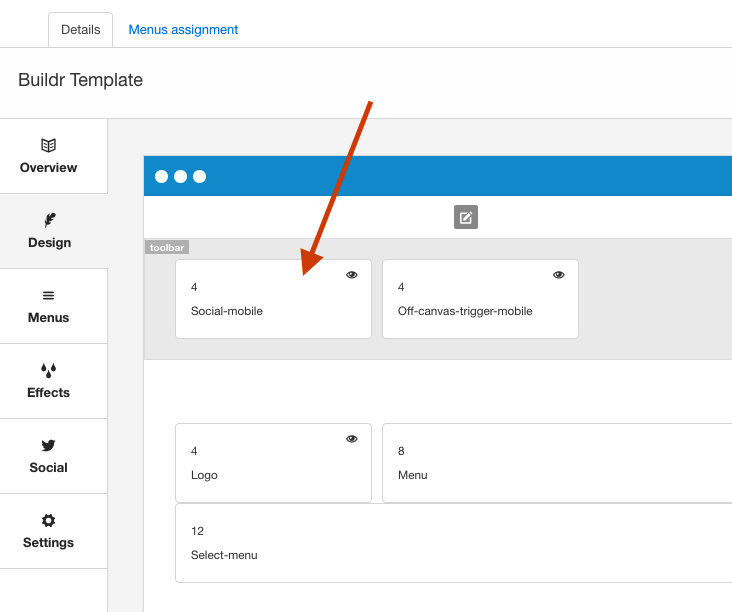

The following is a reference for the terms used in the documentation.

## Template
Refers to a Joomla template.

## ZGFv5

- Refers to the Zen Grid Framework v5.
- The Zen Grid Framework is the framework that this template is built upon.
- The framework simply provides the various functionality behind the scenes.
- It is a collection of files located in the zengrid folder of the template. eg yoursite.com/templates/buildr/zengrid

## Zen Grid Framework Ajax Plugin
This is a plugin that is required by all Zen Grid Framework v4 templates. It provides a variety of functionality for the administration of the template including compiling less to css, compressing javascript, loading and saving layouts and presets etc.

## Theme
- Refers to the current design of the template. 
- Themes are loaded via the preset panel in the template's general settings sidepanel.

## Template instance
Joomla provides the ability to make copies of templates so that template instances with different configurations can be applied to different menu items. Template instances are also commonly known as template styles in Joomla. A template style does not refer to a ZGFv5 theme.

## Layout block
Item in the layout tool that can be used to render content eg a module position, responsive menu etc

Layout blocks can be dragged to different areas of the layout and resized to change the width of aa position.

## Layout tool
The area in the template settings where the layout of the template is defined. 

