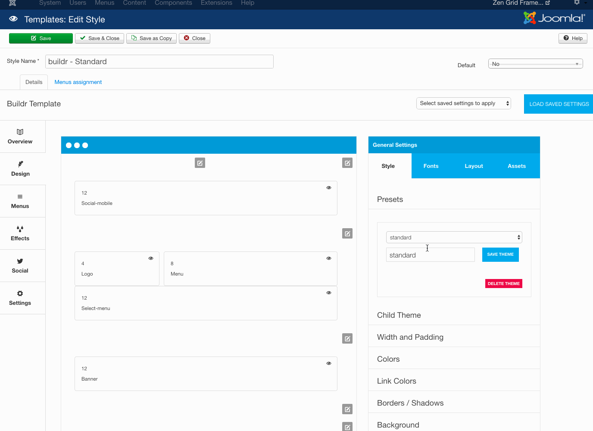

Build.r has a powerful preset function that allows the user to create an unlimited array of theme presets. Each preset is able to store it's own colour, layout settings and more.
----

To save a new theme follow the steps outlined below:

1. Load one of the existing preset themes.
2. Make changes to the theme - eg change colours, widths etc
3. Type a new name for your new preset in the preset input box.
4. Click save
5. To use your new preset in the current template style click save in the top left hand corner.

After clicking save the css and other assets for the theme are created and saved to the template folder.

