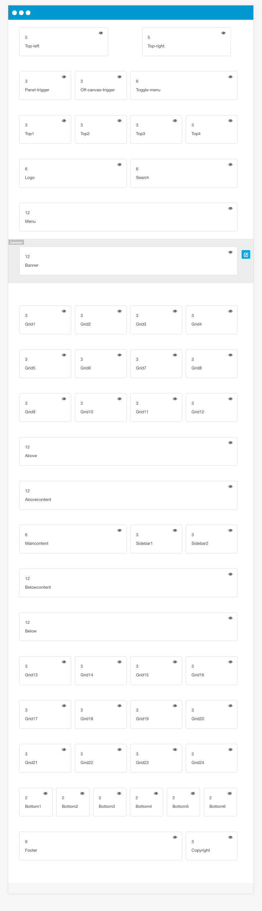

While the position of modules int he Build.r template is very flexible and modules can be moved to any row in the layout, the template comes with a starting point that may be handy to reference when working with the template.

 