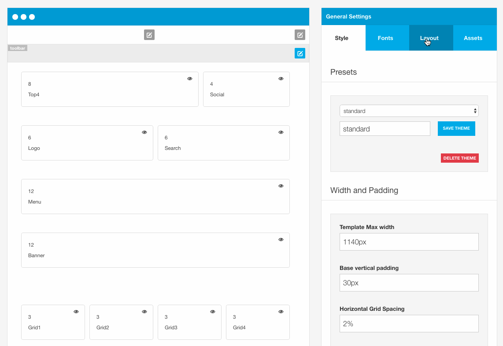
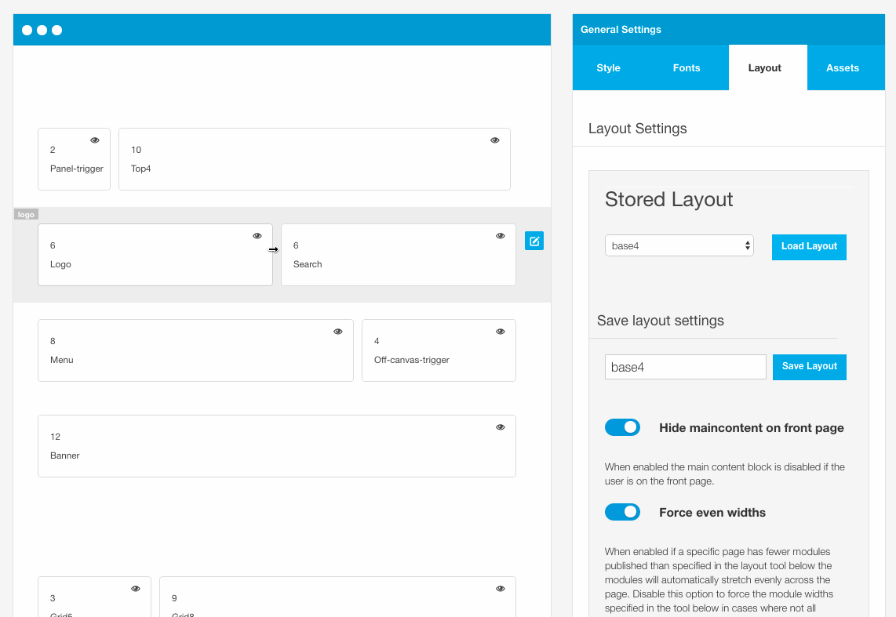

In Zen Grid Framework v5 themes it is possible to reuse module layouts across different instances of the template. A layout simply holds the information of which modules are published for each row and their respective widths.

## Loading saved layouts

Users can load previously saved layouts by navigating to the layout tab in the side panel and selecting the layout they wish to use and then clicking the load layout button. When this is done the layout panel is refreshed with the new layout information.

## Saving layouts

Users can also save layouts by navigating to the layout tab in the side panel. In the Save layout panel type the name of the new layout and then click the save layout button. Once this has been done the layout will be available for use in other instances of the template.

Once a layout is saved it is added to the list of available layouts and then available to be loaded.

To avoid writing over layouts shipped with the template it is advised that you use a new name for the layout eg base4-new.

