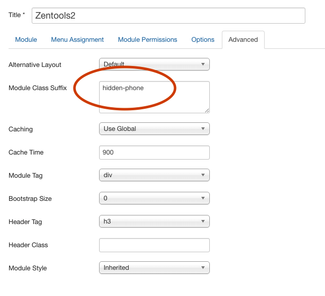

In order to hide specific modules at specific screensizes it is necessary to add a **module class suffix** to a specific module that you want to hide.

## How to add a module class suffix to a module

1. Navigate to the module manager and edit the module you want to target
2. Click on the advanced module tab
3. Enter the module class you want to attach to that module eg hidden-phone
4. Click Save

## Responsive classes to be used for modules

The following can be added to a module to make it hide or display at a specific screensize.

#### Hide classes

- hidden-desktop
- hidden-tablets
- hidden-tablet
- hidden-phones
- hidden-phone
- min-width-desktop
- min-width-tablet
- min-width-phones
- hidden-navcollapse
- hidden-gridcollapse

#### Visible classes

- visible-desktop
- visible-tablets
- visible-tablet
- visible-phones
- visible-phone
- visible-navcollapse
- visible-gridcollapse

