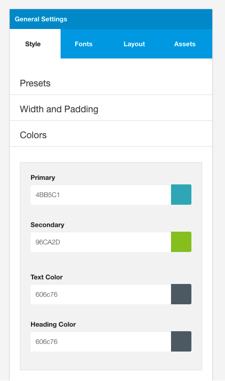

The Color panel holds the base colors used in the template. 

**Note:** The colors set in this panel can be re-used across other settings in the template using less variable syntax eg @primary will use the value set here.

## Primary (@primary)

The color used as the primary color of the palette across the theme.

## Secondary (@secondary)

The color used as the secondary color across the theme.

## Heading Color (@heading-color)

This color is applied to all headings on the page including blockquotes. Headings that are also links will also inherit this color.

## Text Color (@text-color)
The color used for all text elements on the page. This value is applied to the body tag, p tags and list tags on the page.

