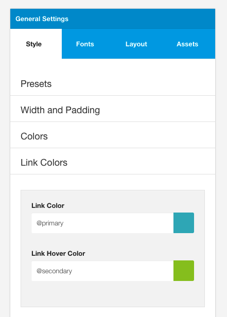
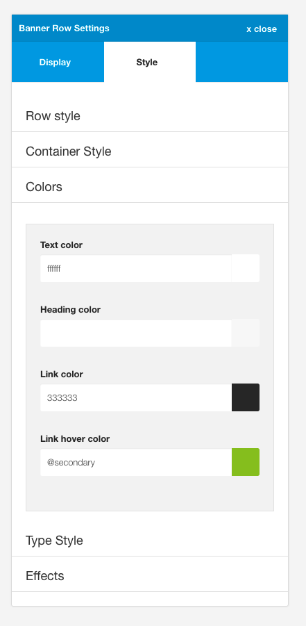

The link color panel determine the colors used for links and their hover colors.

These values apply for all links except for the following cases:

- Links that also use the btn class (they inherit the button colors).
- Headings that are also links. They inherit the Heading color
- Any rows that have the link color set in the row setting options.

## Overriding the link color in a single row

To change the color of links in a single row use the row settings for the specific row that you would like to target.

Setting the values as per the screenshot below will apply the #333333 and the color set for the @secondary value for all links and link hovers in that row. 

**Note:** This will apply to all links excluding buttons and headings that are also links. The color set here will also define the color and border of any links that use the btn-empty class.

