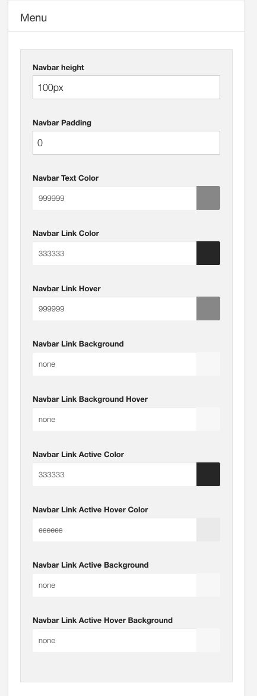

The settings on this panel refer to the colours used in the top level of the main menu. This is the menu that is rendered when using the menu module position or the menu rendered when using the one page menu block.

**Note:** The settings in this panel will override the link colors set in a row's settings. 

Eg if you move the menu to the toprow and also set the link colors in the toprow settings side panel the colours defined in this panel will override the colors defined in the toprow settings.

