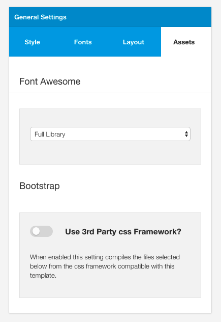

## The Design Panel

The design panel holds 99% of all layout and display related settings. There are a number of settings that have been logically grouped outside of this panel e.g. the dropdown menu widths, however the vast majority of control of the layout and display of the template can be found in the design panel.

#### The following is an overview of the general function of each part of the design panel. For more detailed instruction please see the relevant section in the design panel for more information.
 
## The Layout area

All aspects of the layout are controlled in the layout area. This includes the positioning of specific modules in the layout as well as the widths applied to each module.

Each block in the layout area can be moved to a new row or position inside a row via dragging and dropping the block. Each item can be resized by hovering the mouse on the right edge of the layout block.

## General Settings

The general settings panel contains the settings that affect the general style / theme colours and other design elements including fonts, general layout control, 3rd party assets such as Font Awesome and Bootstrap.

## Style Tab
The style tab holds any relevant design settings that affect all of the template. This group of settings provides control over colours, widths, spacing, social icons, borders and shadows.

## Font Tab

The font tab contains the settings that allow the user to change the basic font sizes used in the template, the font family and weight for body, menu, headings and logo fonts as well as custom fonts.

## Layout Tab

The layout tab contains parameters that allow the user to load a new layout, save a layout, adjust the responsive breakpoints and widths, seletc the collapse menu etc.

## Assets Tab

The assets tab controls setting that determine how 3rd party libraries such as Font Awesome and Bootstrap are implemented in the template.

## Row Styles

Style for specific rows or groups of modules are shown when the user clicks on the edit pencil for that specific row.

Clicking on the pencil in a row.

Will reveal the settings for that row.

The row style settings panel contains parameters for the following elements:

## Available Modules
Any native positions for that row. While any position can be moved to a relevant position, if a position is not used in the layout it is returned to the row that is specified in the templates settings/position.json file.

## Responsive control

Toggle buttons that determine if a specific row can be seen or hidden at various screen widths, or whether it should be displayed in a stacked layout (all positions are 100% width) or whether the layout widths should override the grid collapse setting.

## Row Style

Contains the settings for the specific row. The row is the part of the layout that includes the entire area from the left and right edge of the screen. Setitngs here allow the user to adjust the background colour, image, padding, margin, border and whether or not to use an overlay.

## Container Style

Contains the settings for the container in a specific row. The container is the part of the layout that is inside the row and is restricted by the width set in the template width in the general style section. Settings here allow the user to adjust the background colour, image, padding, margin, border, whether or not to use an overlay apply a shadow on the container and to make the container the full width of the screen.

## Colors

Contains settings that determine the text, heading, link and link hover colors for that row,

## Type Style
Determines whether or not to apply a preset style to headings for that row.

## Effects

