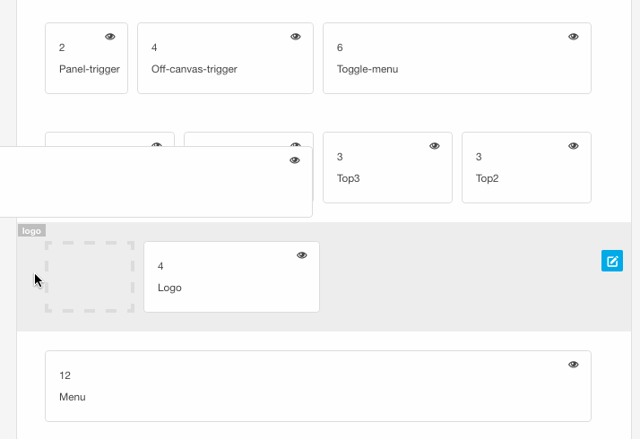
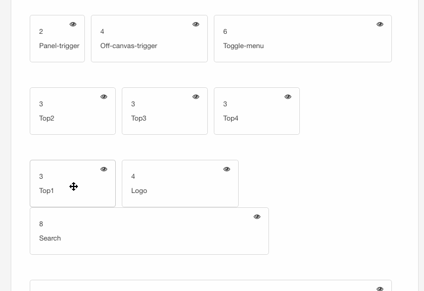

## Moving modules within a row 
Module can be moved within a row by clicking on the position you want to move and holding the mouse button down while moving the item. A square with a grey border will appear and show you where you can move the module to.

## Moving modules to a new row 
Moving modules to a new row is achieved by using the same method.

