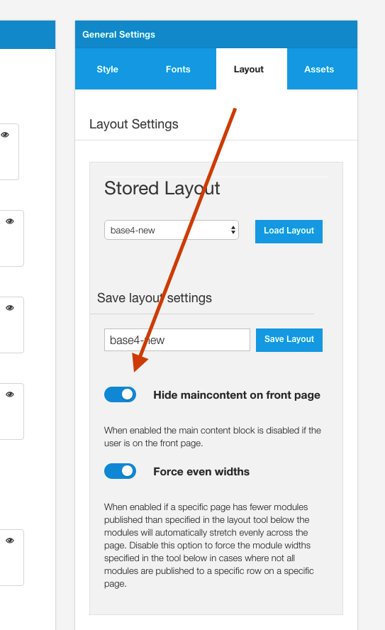
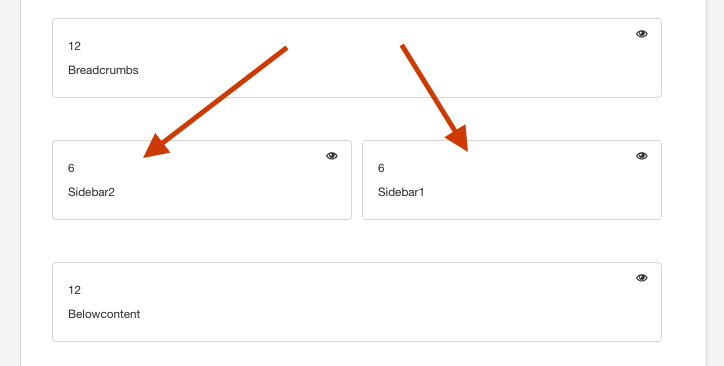
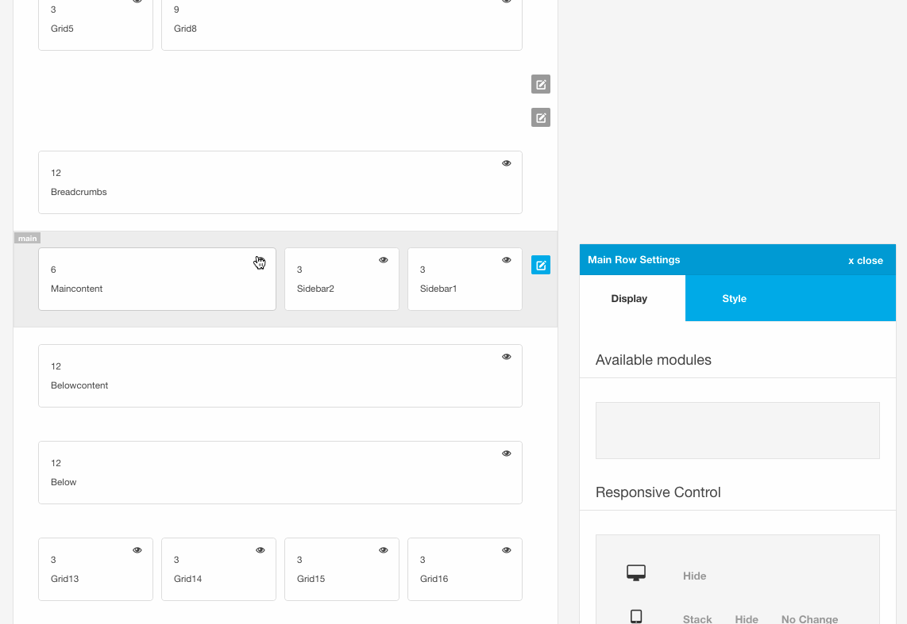
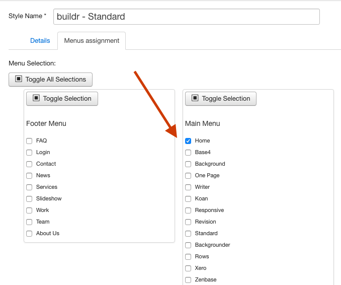

In some cases you may want to have a module only front page layout, where the front page content is generated by modules such as zentools. In order to achieve this you can follow two separate workflows.

## Hide the main content button

When this option is enabled the main content area block will not display on the front page of your site. 

This includes pages that do not have a menu item that points to it's specific category. When Joomla can not find a menu item that points to the category of the content you are trying to display it will display the module configuration for the front page. This is commonly known as a the Joomla menu item id issue.

**If you are having trouble with the template not showing your content an easy step to test this is to disable this option and see if the content is shown.**

It's important to note that when this option is enabled in addition to the main content the sidebars, abovecontent and belowcontent modules will also not be displayed.

## Remove the main content block

In the case that you may wish to create a layout that includes the sidebars, abovecontent and below content positions but continues to hide the main layout you may wish to remove the main content block entirely from the template.

#### How to hide the main content block

In this case if you had other pages that you wanted to show the main content you would need to ensure that this template style is not set as the default template and that it is assigned to the home page or to the page you wished to hide the main content on.

## Template hiding main content is only set to display on home page
