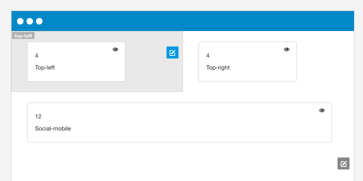
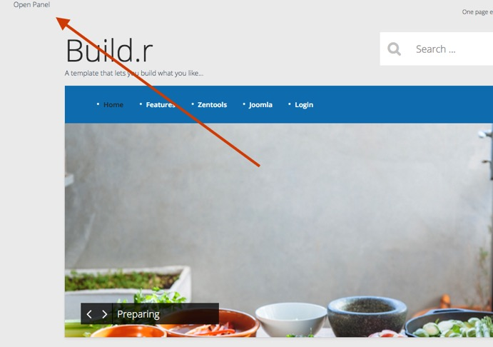
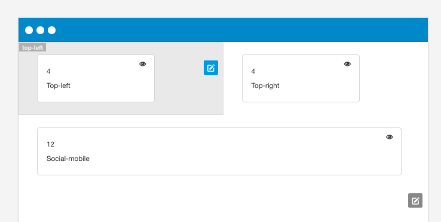
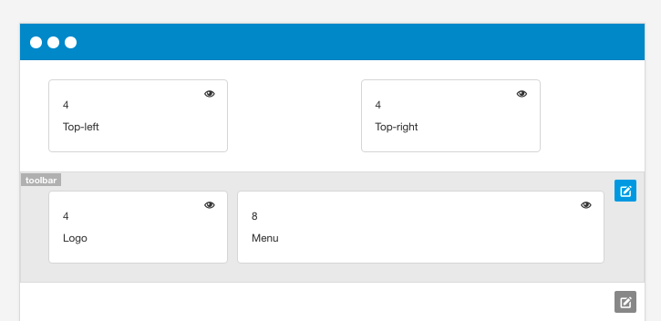
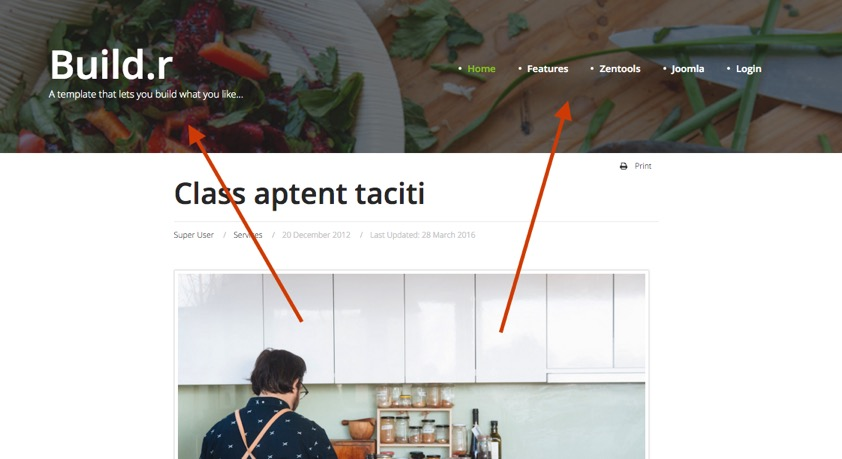

Some of the rows of modules in the template use fixed positioning. We added this option for the following areas of the template to make it easy to fix certain elements on the screen.

## Top left position

This are of the template positions a module or layout element to the top left of the page.

#### Example

The example below shows the hidden panel trigger assigned to the top left position in the Base4 theme.

## Top right position

This are of the template positions a module or layout element to the top right of the page.

#### Example

The screenshot below shows the off canvas trigger layout element assigned to the top right position as seen in the Writer theme demo.

## Toolbar

This are of the template positions a module or layout element to the very top of the page. This is ideal for displaying the logo an menu in a fixed position at the top of the page.

#### Example

This screenshot is from the Writer theme example. The logo and menu position is assigned to the toolbar row and it sits above the banner module position which has the background image assigned to it.

