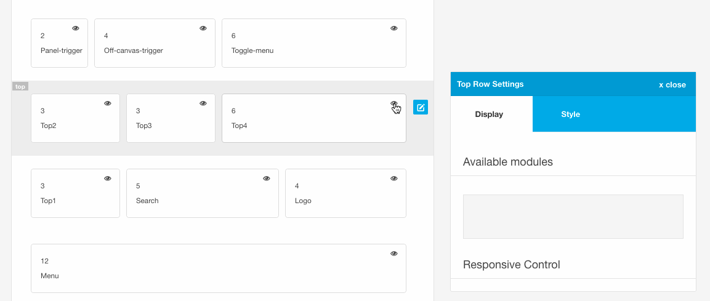
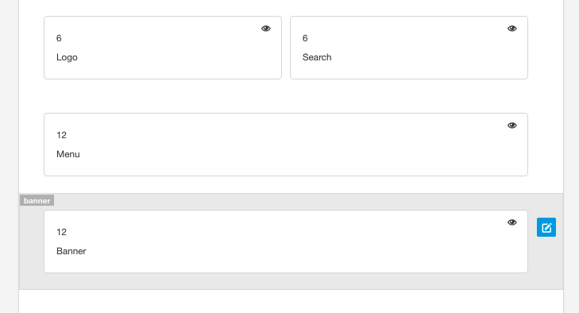
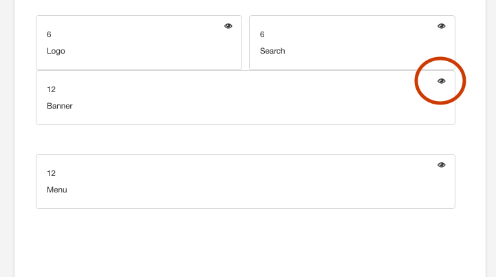
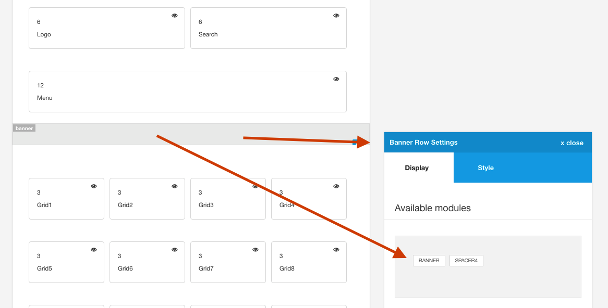

To hide a module in the row click on the eye icon in that specific module block. To reinstate that module to it's native row click on the module name in the available module area for that row.

## Positions revert to their native row when hidden

If you have moved a module to a new row and then hide that module (using the eye icon) the module will go back to it's native position.

eg if you move the banner module to the logo row and then hide it, the module will now be found in the available modules in the banner row and not in the logo row.

#### Banner in it's native row

#### Banner moved to logo row

#### When the eye icon is clicked the banner module is added to the banner available modules and not the logo available modules.

