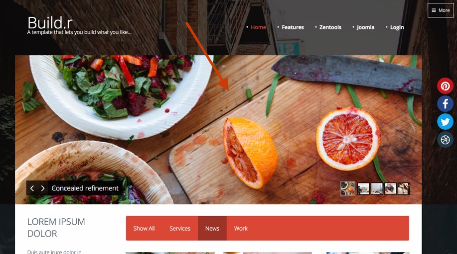
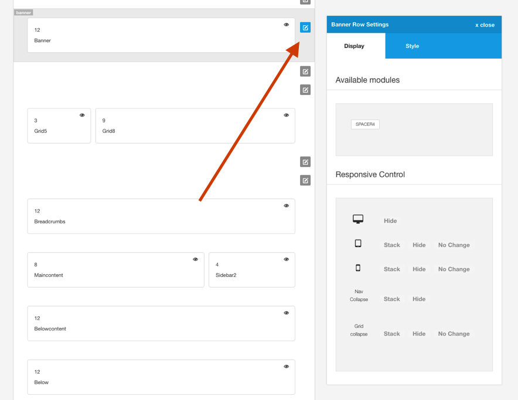
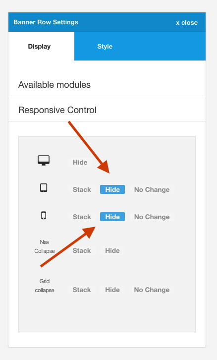
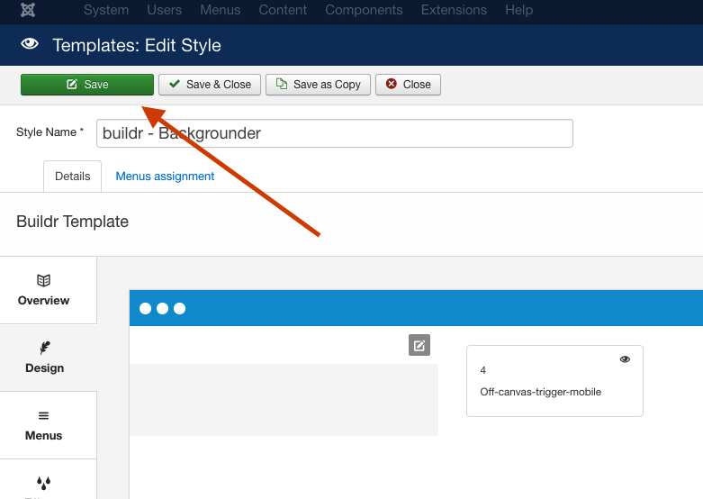

An important part of responsive design is being able to hide, show or otherwise control the appearance of elements at various screensizes. 

Zen Grid Framework 5 themes have the capacity to hide entire rows at various screen sizes from within the template settings. Specific modules can be hidden at various screensizes by applying a module class to the instance of the module you would like to hide.

## Hiding rows of modules

The easiest way to hide an entire module row at a given screensize is to use the responsive control blocks in the row settings for your selected row.

## Hiding the banner row
In the example below we are going to hide the banner module (slideshow) in the Backgrounder theme.

By default the Backgrounder theme in the demo looks like the screenshot below.

As you can see the banner is clearly visible.

## To hide the banner row for a specific screensize

To hide the banner row for tablet and phone sizes we need to edit the banner row settings by clicking on the pencil on the banner row in the template admin.

## Check the hide button for phone and tablet

The next step is to click the hide button for both phone and tablet sizes. (The actual screenwidth that these screens sizes relate to is set in the layout > breakpoints tab in the general setting sidebar.).

## Save your changes
Once you have done this save your changes by clickin on the save button on the top left of the screen.

## The result

Now on the fronpage of your site you should clearly see the banner row on screensizes at desktop or bigger, while anything smaller than Tablet will be hidden.

