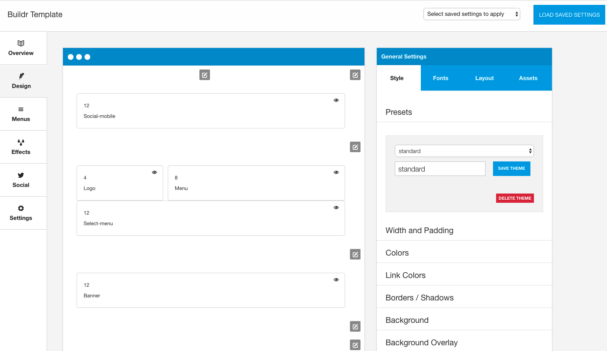
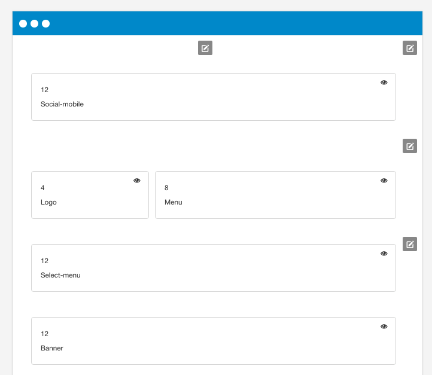
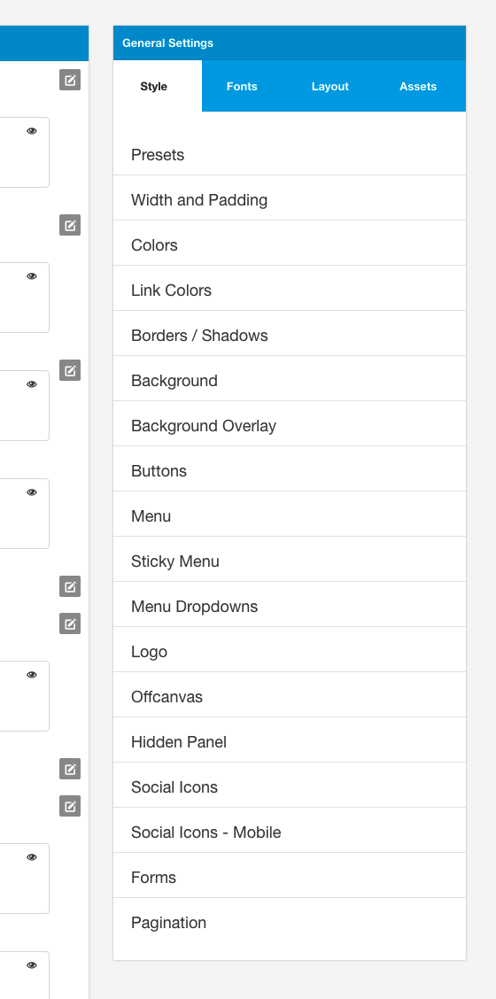
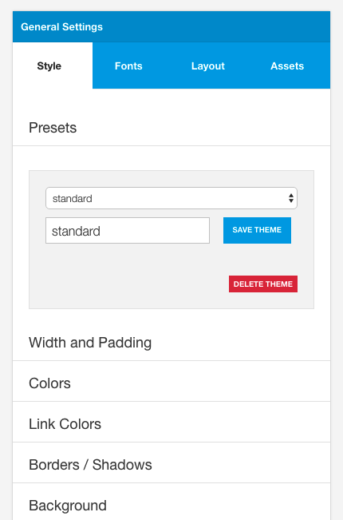
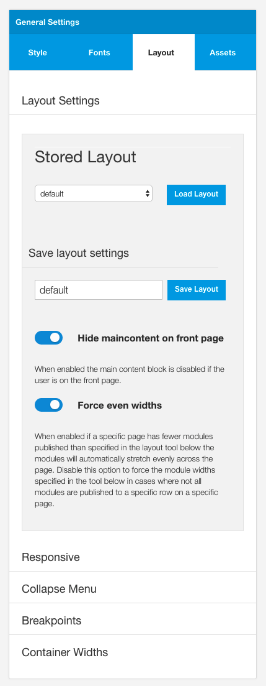

## The Design Panel

The design panel holds 99% of all layout and display related settings. There are a number of settings that have been logically grouped outside of this panel e.g. the dropdown menu widths, however the vast majority of control of the layout and display of the template can be found in the design panel.

#### The following is an overview of the general function of each part of the design panel. For more detailed instruction please see the relevant section in the design panel for more information.
 
## The Layout area

All aspects of the layout are controlled in the layout area. This includes the positioning of specific modules in the layout as well as the widths applied to each module.

Each block in the layout area can be moved to a new row or position inside a row via dragging and dropping the block. Each item can be resized by hovering the mouse on the right edge of the layout block.

## General Settings

The general settings panel contains the settings that affect the general style / theme colours and other design elements including fonts, general layout control, 3rd party assets such as Font Awesome and Bootstrap.

## Style Tab
The style tab holds any relevant design settings that affect all of the template. This group of settings provides control over colours, widths, spacing, social icons, borders and shadows.

## Layout Tab

The layout tab contains parameters that allow the user to load a new layout, save a layout, adjust the responsive breakpoints and widths, seletc the collapse menu etc.

