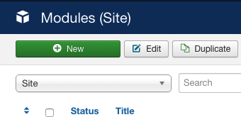
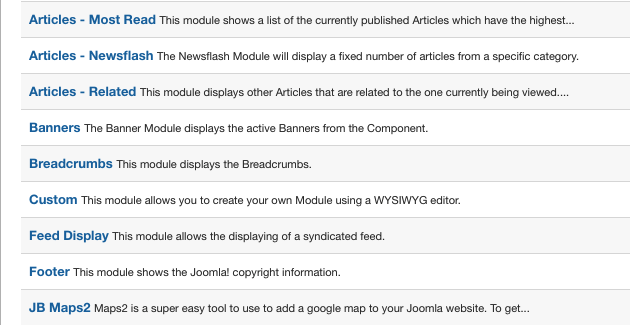
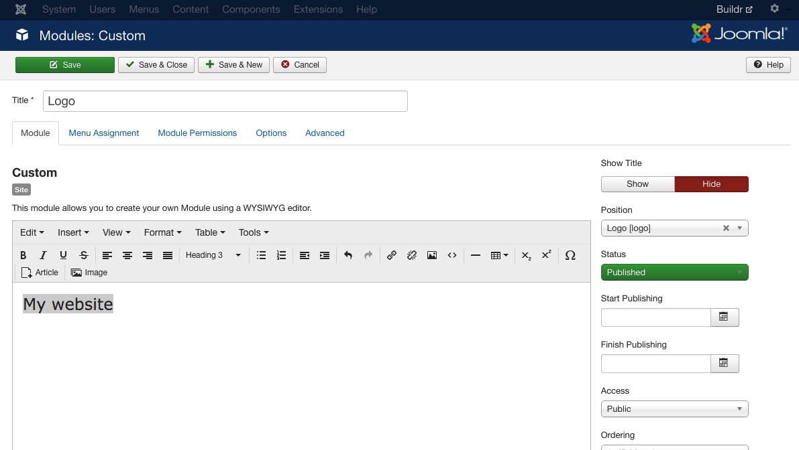
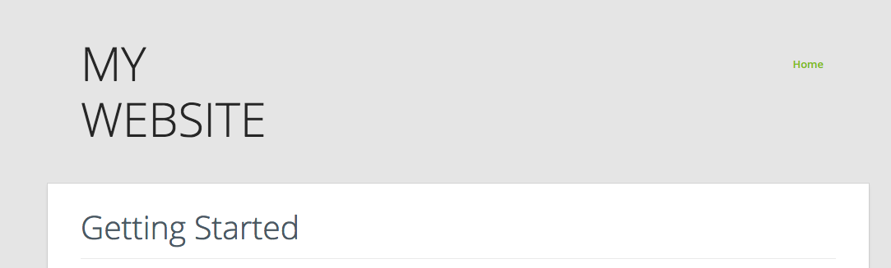

	
## Create the logo module

The logo for the Buildr template uses text in a custom html module published to the logo position.

a. Create a custom html module called logo, via the extensions > module manager.

b. Add your logo text or image, set the module position to logo and hide the module title.

The markup used for the logo in this template is as per the following:

	<h2><a href="/">Buildr</a></h2>

Now your site should be slowly starting to take shape and the top part of the site should look like the following screenshot. For help with controlling the logo font, size and colour see the [logo section of the documentation](../../logo).

