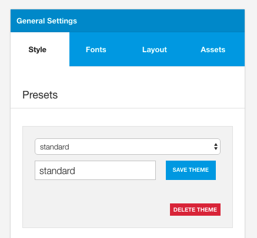
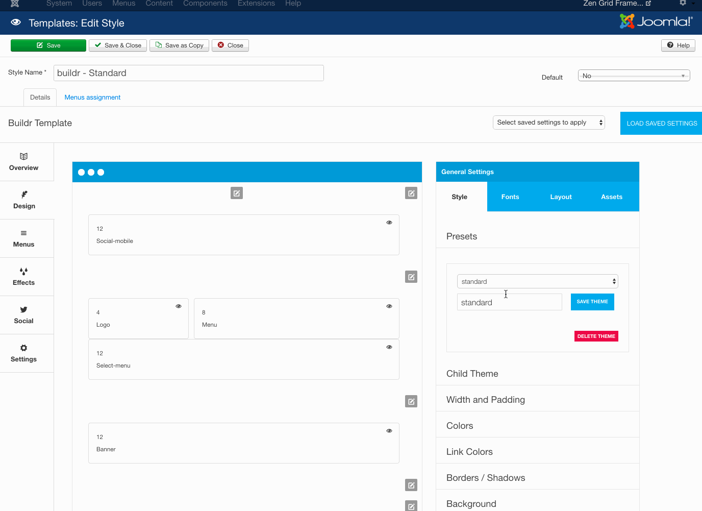

Zen Grid Framework themes come with the ability to save the colour and other information from your current template configuration in the form of presets in your template for reuse across other instances of the template.

Each theme is shipped with a set of default themes that can be found in the settings/themes/presets folder.

## How to save a new preset

1. Type the name of the preset in the input box.
2. Click "Save Theme"
3. This will save the theme and compile it's assets in the css folder.
4. If you need to apply the preset to the current template click save in the top left hand corner

## Developer notes

## Theme Assets
Each time a theme is saved the following files are created:

settings/themes/my-new-theme.json
css/my-new-theme.css - The css fiel for the theme
css/my-new-theme.php - The gzipped css file loaded if gzip is enabled
css/my-new-theme.map - The less map for the theme 

## Theme Format
Any newly saved theme is saved to the settings/themes folder.

Each theme is stored in json format using two groups of objects: settings & colors:

Settings (any parameter that isn't set by using the color picker): 

	{
	  "settings":{
	    "twidth":"980px",
	    "base-padding":"30px",
	    "gutter-pc":"2%",
	    "containershadow":"0 0 0 1px rgba(0, 0, 0, 0.06), 0 3px 8px rgba(0, 0, 0, 0.06)",
	    "wrap-overlay-fade":"40%",
	    "wrap-overlay-height":"100%" ...

The color object (all items set via the color picker):

	"colors":{
	    "primary":"96CA2D",
	    "secondary":"3B424C",
	    "border-color":"eeeeee",
	    "text-color":"ffffff",
	    "heading-color":"eeeeee",
	    "spotlight-bg":"none",
	    "link-color":"@primary",

