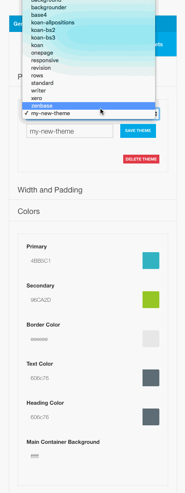

Zen Grid Framework v5 themes come with a built in preset system that allow you to load predefined presets stored in the template package or to create your own presets as seen in the saving presets documentation.

To load a new preset simply select the preset from the list of presets and the preset will automatically load.

**When a preset is selected the various settings for the new preset are loaded into the interface. As you can see in the screengrab below, the colours of the new theme are automatically loaded.**

 