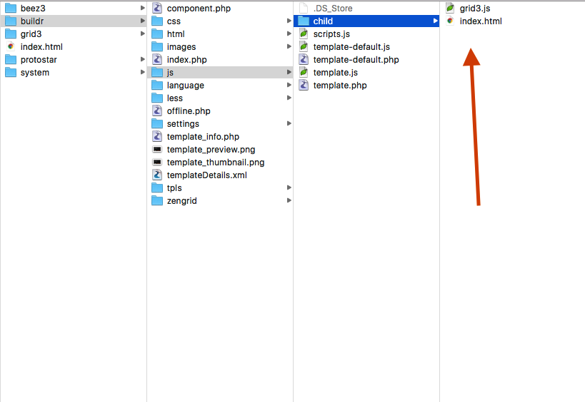
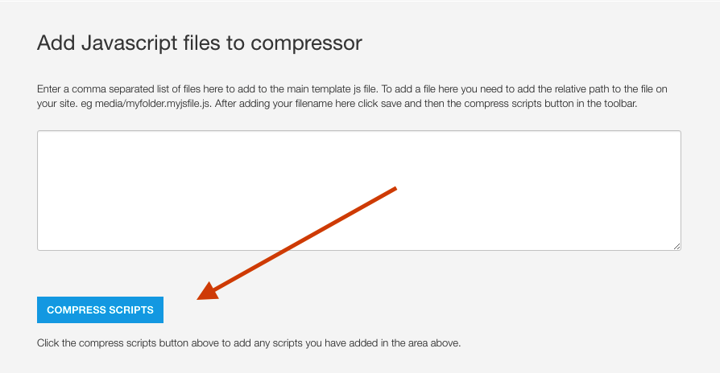

Buildr has the capacity to support child theming. 

Child themes are an additional less file and optional javascript file that are included in the main theme css and javascript, when selected in the template settings.

The benefit of using a child theme is that in addition to using the built in functions for controlling your website you are able to include additional styling information in the form of the <a href="http://lesscss.org/">less css language</a>. 

This is a supplementary for of customising your Buildr template. Please read the document on <a href="../overview/customisation">customising Buildr</a> to see which way is the most suitable for your workflow with making changes to a template.

**Note:** Please bear in mind that many of the changes that would have needed to have been added via a custom.css file are now controlled via the Build.r template interface.

## How will Joomlabamboo be using Child themes?

Child themes will continue to be added to Build.r as we release new styles and new designs and Build.r will be updated with new child themes as they become available. 

## How do you add a child theme to Build.r?

Child themes are displayed in the Child theme select box when any .less file is added to the less/child folder.

The grid3.less file creates an entry in the Child theme select box.

**Note:** You can have as many child themes in the child folder as required, but only the child theme selected in the select box will be used.

## Adding an optional javascript file
In some cases you may need to add additional javascript to Build.r to support your child theme. Not all child themes will require a javascript file.

Javascript files for your child theme are added by adding a javascript file that uses the same name as your child theme.

When a javascript file is found in this folder that matches the name of the child theme in use it is automatically included in the javascript compressor in the settings panel.

**In order to activate the javascript for the child theme it is necessary to click the Compress scripts button.**

## Developer notes

## Syntax for images in child themes

**Images in the template folder**
In order to reference an image located in the templates/buildr/images folder developers need to use the following syntax:

	background-image: url("../../../images/grid.png")

Where @{image-path} references the path tot he template's image folder.

**Images in the Joomla images folder**

	background-image: url("../../../../../images/deep-water.jpeg")