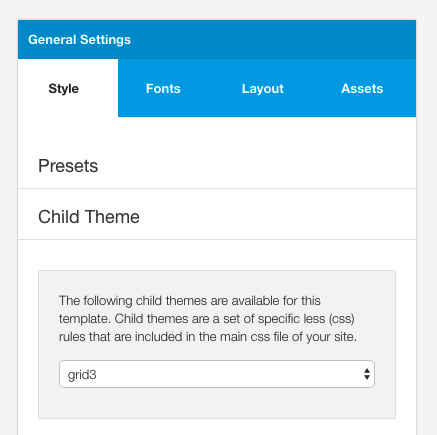
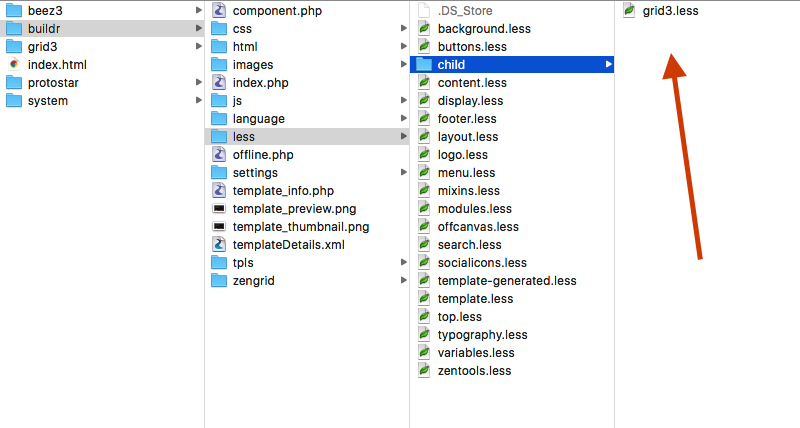
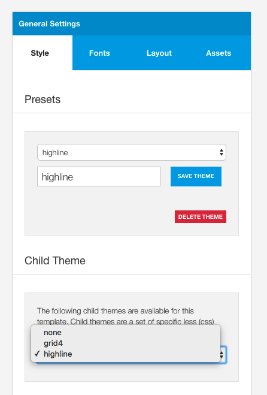
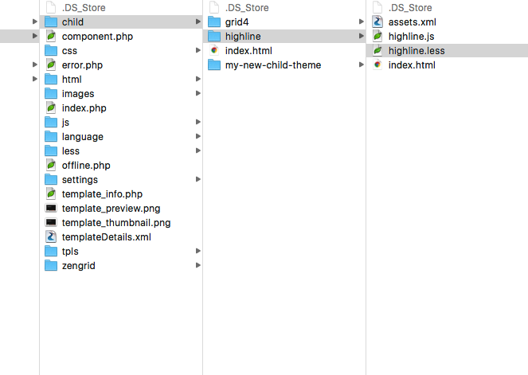
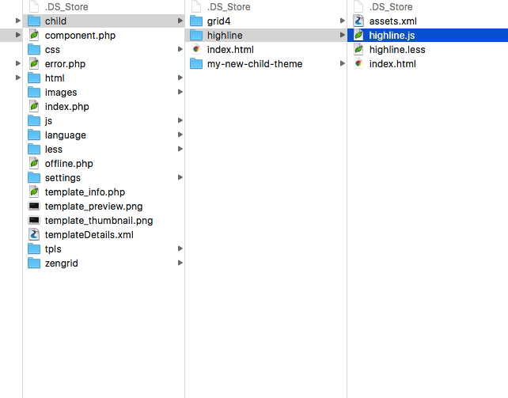
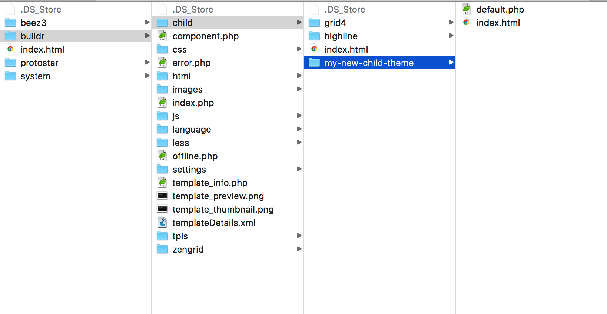
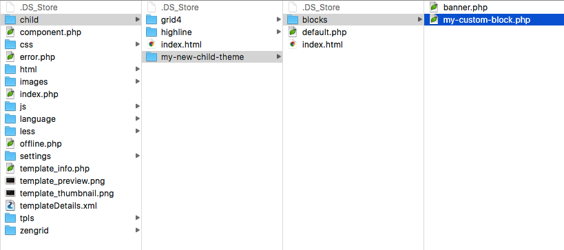

Buildr has the capacity to support child theming. 

Child themes are additional files that can be included in your template to add specific style information, javascript functionality, javascript assets or override the Buildr layouts. 

**Child themes are selected in the General settings side panel in the design panel in the template settings. Child themes can easily be disabled by setting the child theme option to none and then saving your settings.**

## Why use a child theme?

The benefit of using a child theme is that in addition to using the built in functions for controlling your website you are able to:

- include additional styling information in the form of the <a href="http://lesscss.org/">less css language</a>. 
- include additional javascript int he template
- include additional template assets via an asset.xml file
- override the template layout by supplying a new default.php file
- override any of the template blocks

This is a supplementary form of customising your Buildr template. Please read the document on <a href="../overview/customisation">customising Buildr</a> to see which way is the most suitable for your workflow with making changes to a template.

## How do you add a child theme to Build.r?

Child themes are displayed in the Child theme select box when you create a folder in the templates/buildr/child folder on your website.

**Note: Please note that this location was changed from less/child in buildr v1.2.0**

The folders found in the child folder populate the child themes available in the template general settings side panel.

**Note:** You can have as many child themes in the child folder as required, but only the child theme selected in the select box will be used.

## Adding style information

A child theme can include additional style information in the form of a .less file. The less file needs to use the same name as the child theme so in the case where your child theme is called my-child-theme you would need to call the less file my-child-theme.less.

This .less file can include the use of variables and mixins used in the template so long as you also include the templates variables and mixin files.

	@import "../../less/variables.less";
	@import "../../less/variables-generated-devmode.less";
	@import "../../less/mixins.less";

If you import these files at the top of the .less file then you will be able to access data stored in color variables such as **@primary** and **@secondary** as well as other variables such as **@twidth**, **@gutter-sml** etc.

The variables-generated-dev-mode.less file is a dynamically generated variables file that holds all of the variables that are set in the current state of the template. This file is updated each time the template data is saved.

## Adding javascript

Javascript functions that relate specifically to a child theme can be plaxced in the templates/buildr/child/[my child theme]/[my child theme].js file.

When this file is in use the javascript file will automatically load on the site when "load compressed scripts" is disabled and included in the compressed javascript file when the "Compress Scripts" button is clicked in the templates settings panel.

## Adding Javascript assets

The core Buildr template uses the settings/assets.xml file to determine which assets to load in the template. This list of files is also used when the javascript assets are compressed using the compress scripts tool in the templates settings panel.

Child themes can add new javascript assets by adding their own templates/buildr/child/[my new theme]/assets.xml

The asset file uses a typical xml file structure to load the required assets.

	<?xml version="1.0" encoding="utf-8"?>
	<files>
		<js> 
			<file>../zengrid/libs/zengrid/js/debounce-resize.js</file>
			<file>../zengrid/libs/zengrid/js/jquery.matchHeight-min.js</file>
			<file>scripts.js</file>     	
	    </js>
	</files>

Any javascript files found in this file are automatically loaded in the templates load_js function reference.

**Note: It is a requirement that when using this file the last file referenced in the template is the scripts.js file. This is to ensure that the template loads the script file last and that any of the javascript functions referenced in that file can take advantage of the newly added javascript assets.**

It is possible to load external assets or cdn hosted assets by specifying the address for the external resource in the assets.xml file.

## Overriding the default template layout

It is possible to override the default layout of the Buildr template by adding a copy of the templates/buildr/tpls/default.php to the templates/buildr/child/[my child theme]/ folder.

This can be useful if you want to make a change to the main template layout container. The tpls/defrault.php file renders the broad layout of the template include the doctype declaration, the static html class, the main body, module blocks and any other relevant markup.

Some common examples of why you would like to override the main template layout would be:
- you would like to add your own wrapping markup around the main template area
- Add your own meta tags to the template <head>
- Include custom layout blocks that are not found in the core Build.r package
- Add inline style or javascript information.

## Adding child theme layout blocks

In addition to overriding the core template output you can also override the core layout blocks in the template. 
This is done by adding a folder called blocks to the templates/child/[my child theme]/ folder. If your child theme is enabled, the template will automatically load any block overrides found in this folder.

Some common examples of why you would do this are:
- You want to add your own layout / markup to a block loaded by the template.
- You want to add your own custom block.

### Adding a custom block
If you are adding your own custom block to the layout then you will need to:

1. Add a new default.php layout override (see previous section).
2. Add your custom block file to the child/[my child theme]/blocks folder.

3. Add a hook for that new block in your new default.php file.

A block is loaded in the Buildr template by using the following syntax:

	<?php $zen->loadBlock('my-custom-block'); ?>

## Developer notes

## Syntax for images in child themes

**Images in the template folder**
In order to reference an image located in the templates/buildr/images folder developers need to use the following syntax:

	background-image: url("../../images/grid.png")

Where @{image-path} references the path tot he template's image folder.

**Images in the Joomla images folder**

	background-image: url("../../../images/deep-water.jpeg")

## How will Joomlabamboo be using Child themes?

Child themes will continue to be added to Build.r as we release new styles and new designs and Build.r will be updated with new child themes as they become available. 