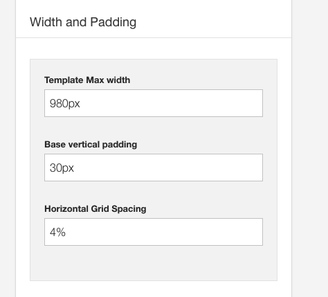
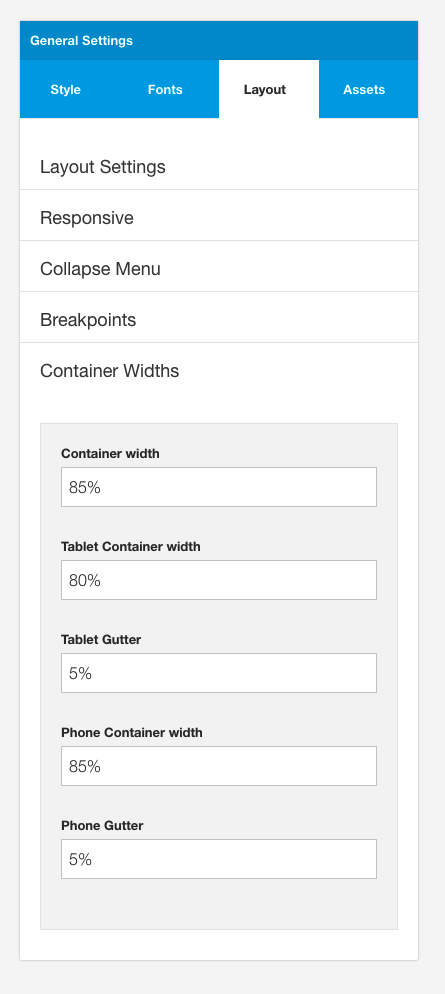
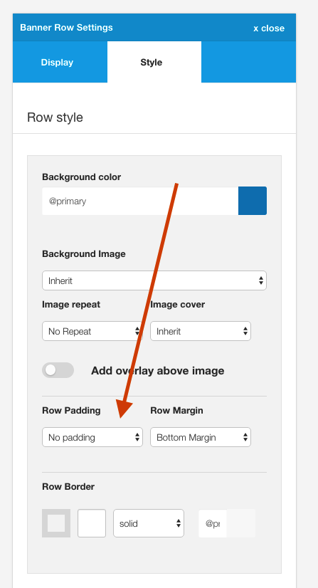
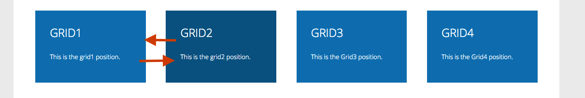

## Template Max Width - eg 1140px

The maximum width that the template will stretch to if the browser is larger than this value. 

**If the browser is smaller than this value then the container width options under the layout tab in the side panel are used.**

## Base vertical padding - eg 30px
The base unit used for calculating margins and padding.

This value is used in a number of areas but in particular for the vertical padding and margins defined in the row settings for each row.

**Note:** Small padding and small margin options use half this value. 

**See the row settings documentation for more information**

## Horizontal Grid Spacing - eg 4%
A value set as a percentage that determines the amount of space between each column in the layout.

To increase the space between module positions change this value to a greater value. To reduce the space between rows completely set this value to 0.

**Note:** Small padding and small margin options use half this value. 