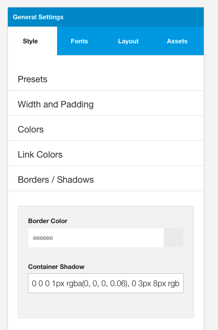
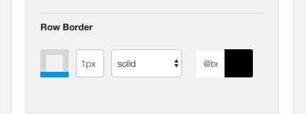
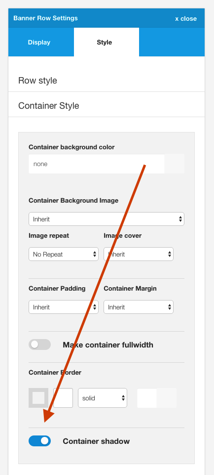
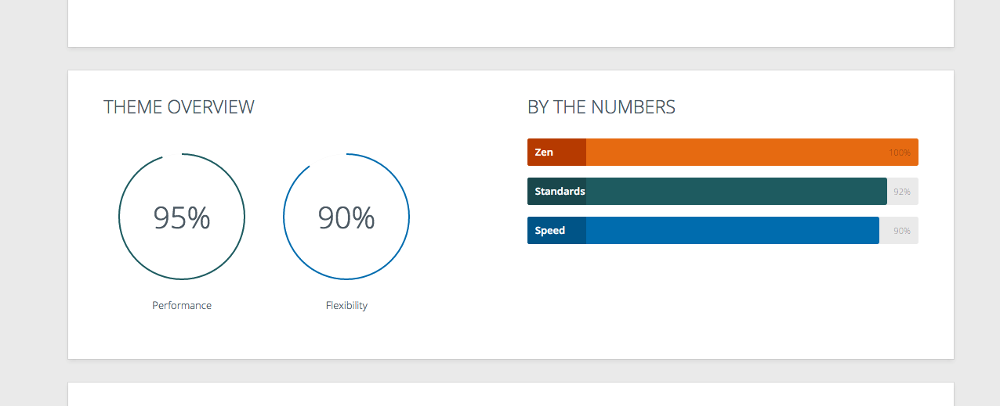

## Border color (@border-color)

The color used to define the border color used across the template. This value can be used in the border color rule found in the row settings as a universal color for borders.

## Container Shadow

This value refers to the shadow used on the container element when the container shadow option is enabled in the row settings.

An example theme that uses this setting is the Base4 style.

