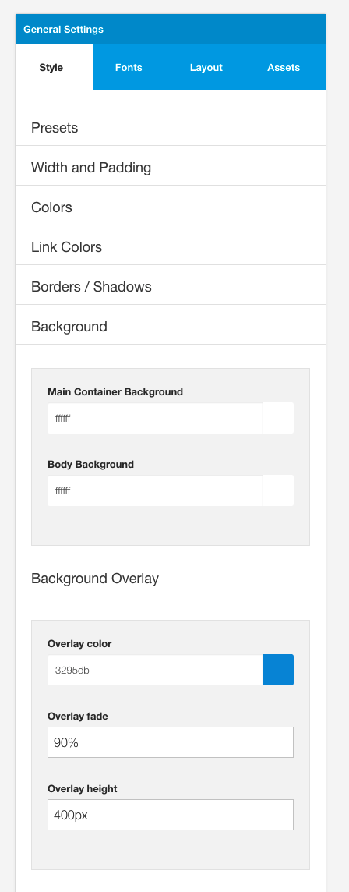
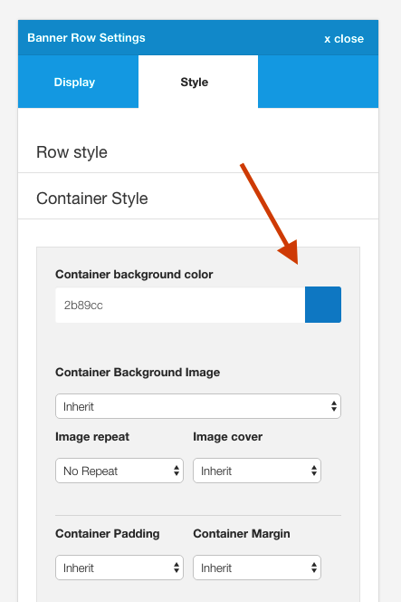
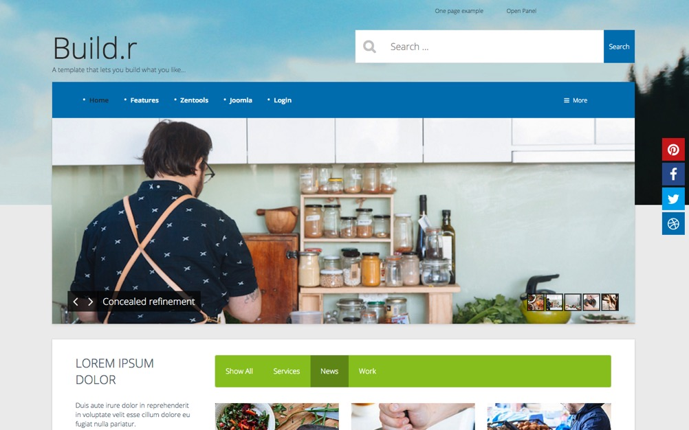
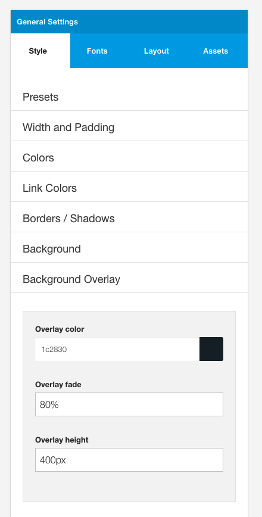
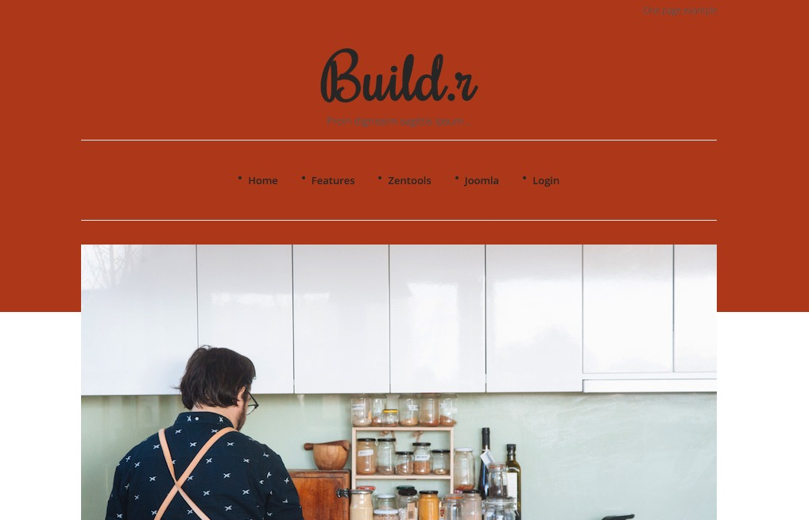
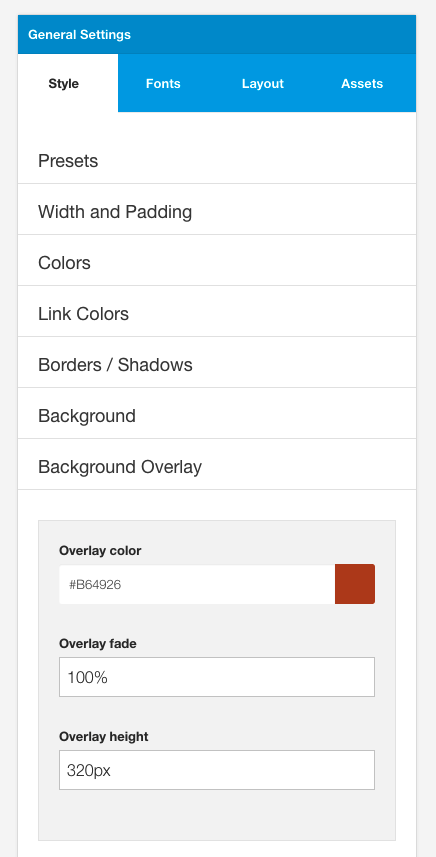

## Main Container background (@spotlight-bg)

This is the main background color used beneath the content area in the template. 

**Note:** This value is specifically over written in the row styles when the container background is set. If the container background is blank then that row will inherit the Main Container Background color. If this value is set to none or transparent then the container for this row will be transparent.

## Background

This option determines the background color of the entire website. The color here is set to the html and body tag of the website.

**Note:** This value will be overwritten if the Background overlay is set and the Overlay fade value is set to 100%. If the Overlay fade value is set to anything above 0 then the resulting colour will be a mix of the overlay background and the body background color.

## Background Overlay

This is a layer that sits beneath the main content and above the body and the background position. 

The background overlay is an element that can be used to create interesting two tone background colours or can be used as as a transparent overlay that sits on top of a module published to the background position.

See examples below.

## Overlay Color

The background color of the overlay

## Overlay fade

A percentage value that refers to the relative transparency or opacity of the overlay. 

eg  a value of 100% set here will render a completely opaque color.

## Overlay Height

This option determines the height of the overlay. Thi value can be set as a px height or a % height. eg 300px or 80%.

To make the overlay stretch to the full height of the browser window set this option to 100%.

## Overlay Examples

## Transparent overlay applied to the Base4 theme
The following screenshot shows an overlay applied to the Base4 theme. By default the Base4 theme does not include any styling for the overlay, however by adjusting the 3 values in the overlay panel you can create the design shown in the screenshot below.

The image underneath is an image from a Zentools2 slideshow published to the background position.

#### Example 

#### Settings

## Solid overlay applied to the Responsive theme

#### Example 

#### Settings

