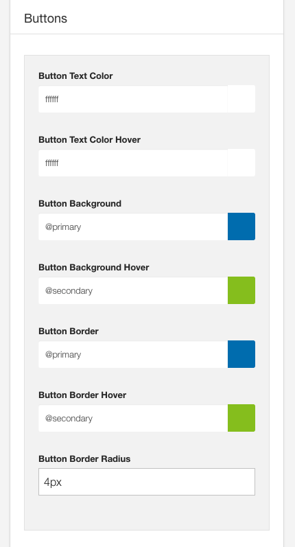

The button panel determines the color, background, border and border-radius of buttons used on the site.

The following rules apply to all items that have the class btn or button.

## Button Text color

The color used for the button text.

## Button text color hover

The color of the button text when the user hovers over the button.

## Button background

The background of the button

## Button background hover

The background color of the button when the user hovers over the button.

## Button border

The border color of the button

## Button hover border

The border of the button when the user hovers over it

## Button border radius

The border-radius of the button. To have 0 rounded on the button set this option to 0. To have a rounded button set this option to 10px.