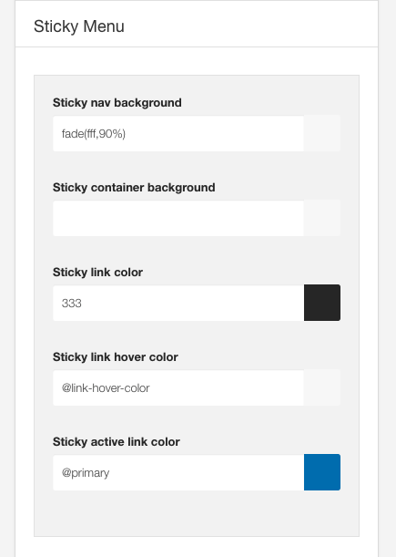
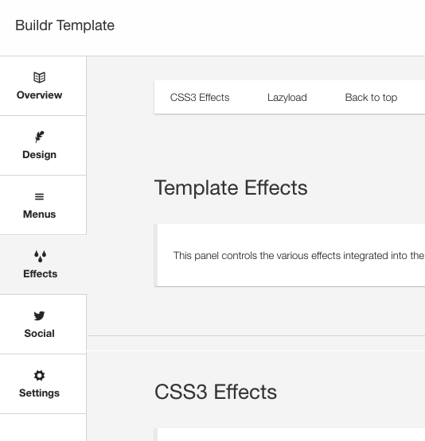
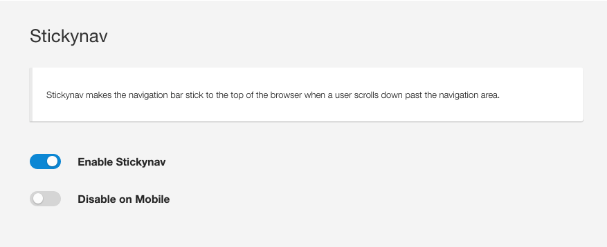
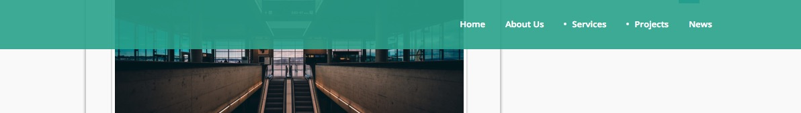
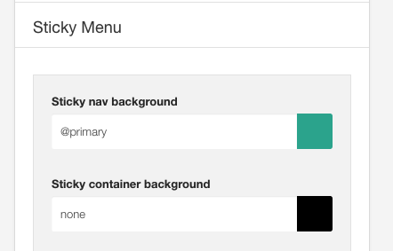
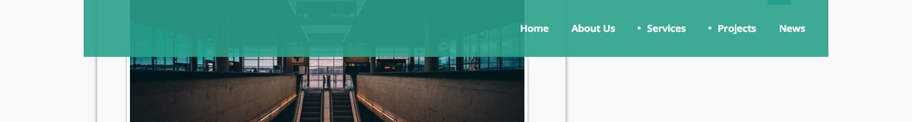
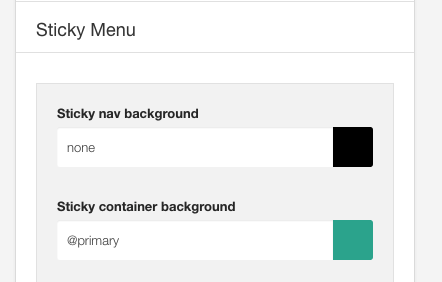

The sticky menu settings in the general settings style panel control the display of the Sticky Menu.

## What is the sticky nav?
The sticky menu sticks to the top of the page as the user scrolls.

## How to enable the Sticky nav

The Sticky nav is enabled or disabled under the effects panel.

## Styling the Sticky menu

It is possible to apply a color to the entire Sticky menu background or to just the container of the sticky menu.

## Sticky Nav Background

This setting refers to the entire row behind the sticky nav, including the container.

If you want to have a full block of colour for the sticky nav then you will need to add a background color here.

**Settings**

To avoid any color being applied to the container area add the word none to specify no colour or transparent color.

## Sticky nav container

**Settings**

To avoid any color being applied to the area outside of the container area add the word none to specify no colour or transparent color.

## Sticky link color

Determines the color used for the link items when the menu is in the sticky position.

## Sticky link hover color

Determines the hover color used for the link items when the menu is in the sticky position.

## Sticky active link color

Determines the color used for the active link items when the menu is int he sticky position.

