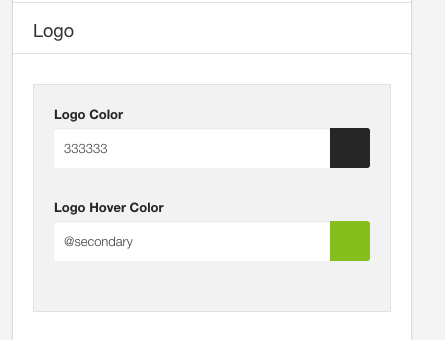

## Logo Color

Determines the color of the logo. This refers to any text in the logo position that uses h1,h2,h3,h4 tags.

## logo Hover Color

Determines the hover color when the users hovers over the logo.