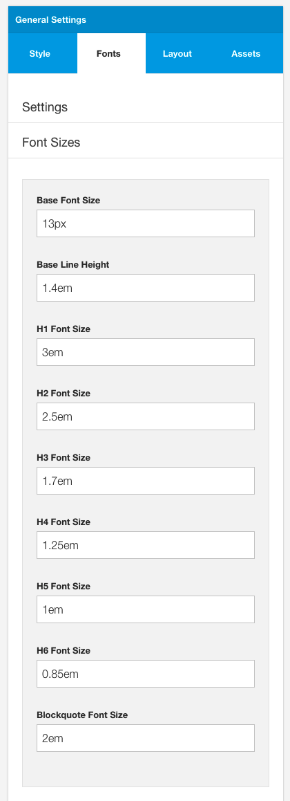

The settings in this panel determine the specific font sizes and values for the following headings and tags:

- Base font size: Applies to the html, body, p tags
- Base line height: Applies to the line spacing used for html, p tags
- h1 - determines the h1 font size
- h2 - determines the h2 font size 
- h3 - determines the h3 font size
- h4 - determines the h4 font size
- h5 - determines the h5 font size
- h6 - determines the h6 font size
- blockquote - determines the blockquotefont size

The values set in this option can be any valid css value for font-size and line-height eg px, em, %, vW

