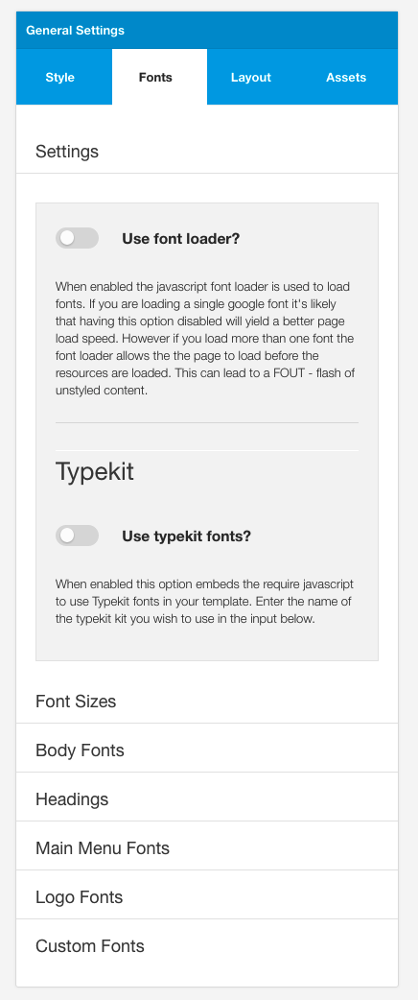

## Font Tab

The font tab contains the settings that allow the user to change the basic font sizes used in the template, the font family and weight for body, menu, headings and logo fonts as well as custom fonts.

