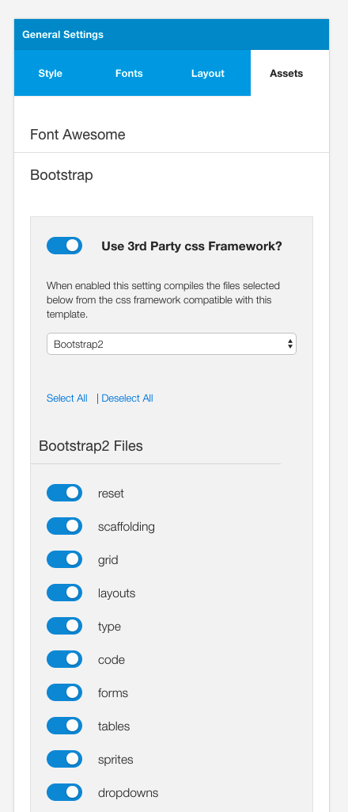

This template comes with support for the Bootstrap2 and Bootstrap3 frameworks. 

## Do you need to include bootstrap?
The template does not require Bootstrap in order to render it's various elements. However if you are using a 3rd party component or module that requires the Bootstrap library then you will need to enable this option for your template.

## How to enable the Bootstrap library

1. In the general settings side panel navigate to the assets panel.
2. Enable the css framework toggle as per the screenshot below
3. Select the version of bootstrap that you wish to add support for
4. Select the items that you wish to load into the template. It's important to note here that if you only need a small portion of the bootstrap framework in your theme then you benefit from a smaller css file if you only select the items required by your component or module.
5. Click save to save your template's configuration

