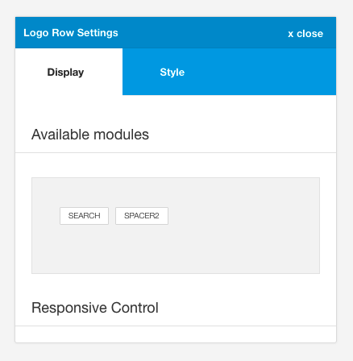
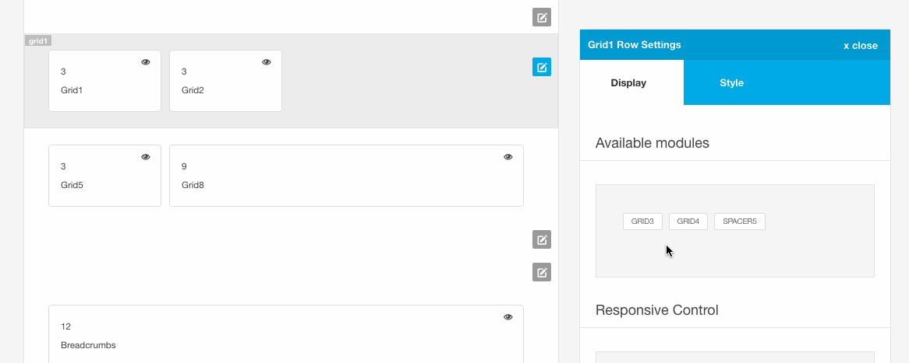

Any native positions for that row. While any position can be moved to a relevant position, if a position is not used in the layout it is returned to the row that is specified in the templates settings/position.json file.

## Adding modules

To add a module in the available module list simply click on the item and it will be added to it's corresponding row.

## How are the available modules determined?

The available modules are defined based on two criteria:

a. The settings/positions.json file defines the row that a specific module is grouped in. This file is a json object that uses the following format:

	{
		"top-left": {
		    "top-left": "4"
		},
		"top-right": {
		    "top-right": "4"
		},
	    "toolbar": {
	        "select-menu": "4",
	        "off-canvas-trigger-mobile": "4",
	        "mobile-logo": "4",
	        "social":"4",
	        "social-mobile":"4",
	        "panel-trigger": "3",
	        "off-canvas-trigger": "3",
	        "spacer1": "4",
	        "select-menu": "4",
	        "toggle-menu": "4"
	    },
	    "top": {
	        "top1": "3",
	        "top2": "3",
	        "top3": "3",
	        "top4": "3"
	    } ...

As an example if a module is specified in the top group of modules then it's native row is the toprow.

The number used in the json object is the default width assigned to the module when the user makes it visible in the layout.

b. However if the module is used elsewhere in the layout ie the module is active in the layout and has been moved to a non-native row, then the list of available modules will not include this module.

eg if the top1 position is to the logo row the top1 position is considered to be used by the layout and is therefore not in the list of available positions. If at some point the top1 position is removed from the layout it will be listed in the toprow available psoition area.

