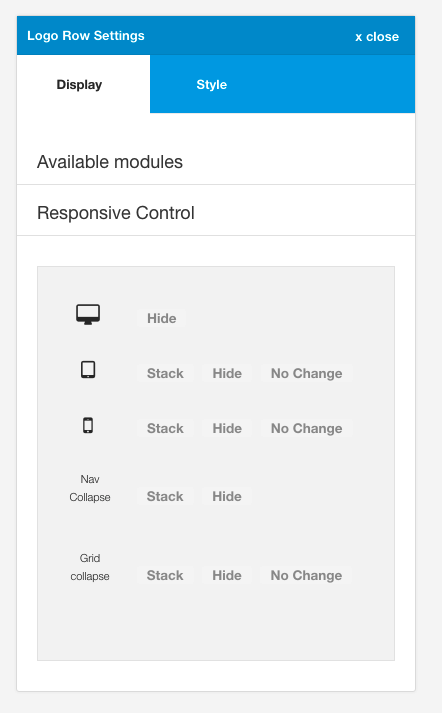
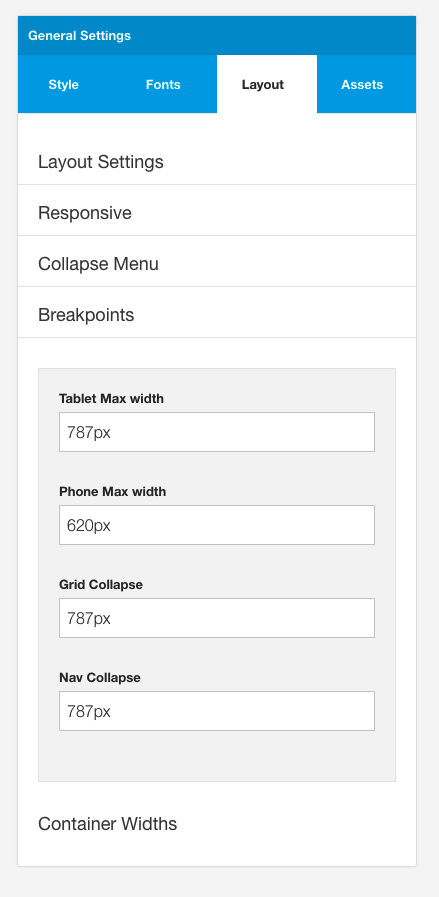
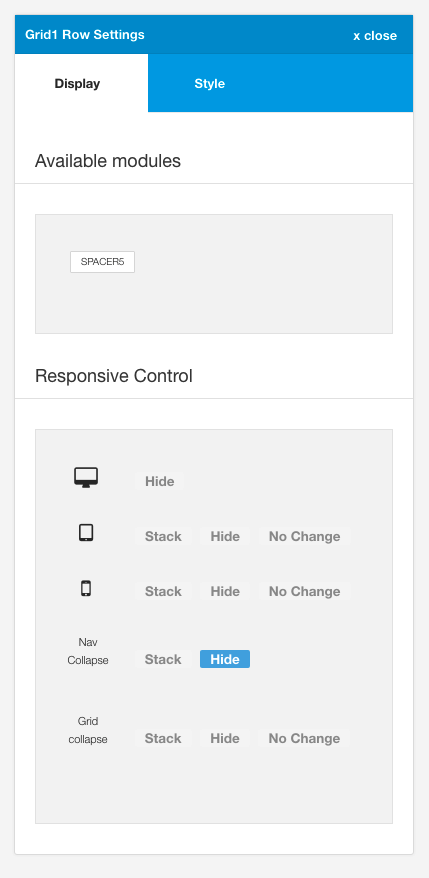
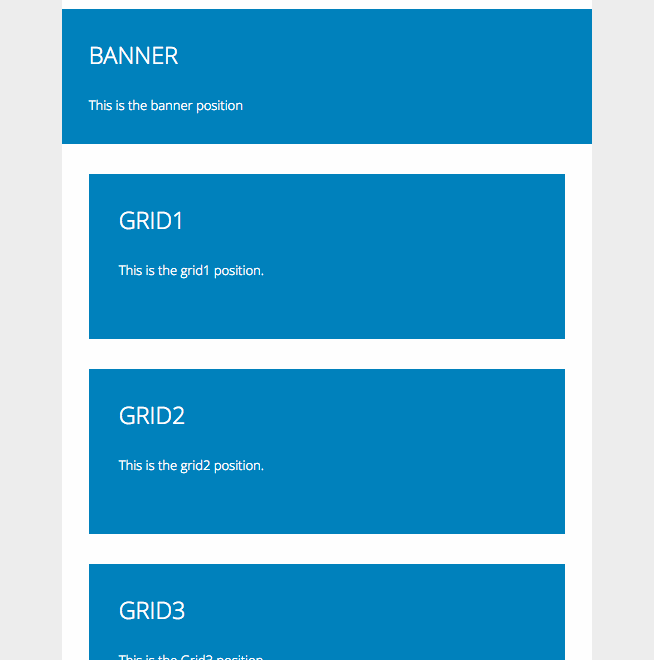
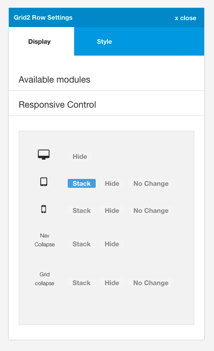
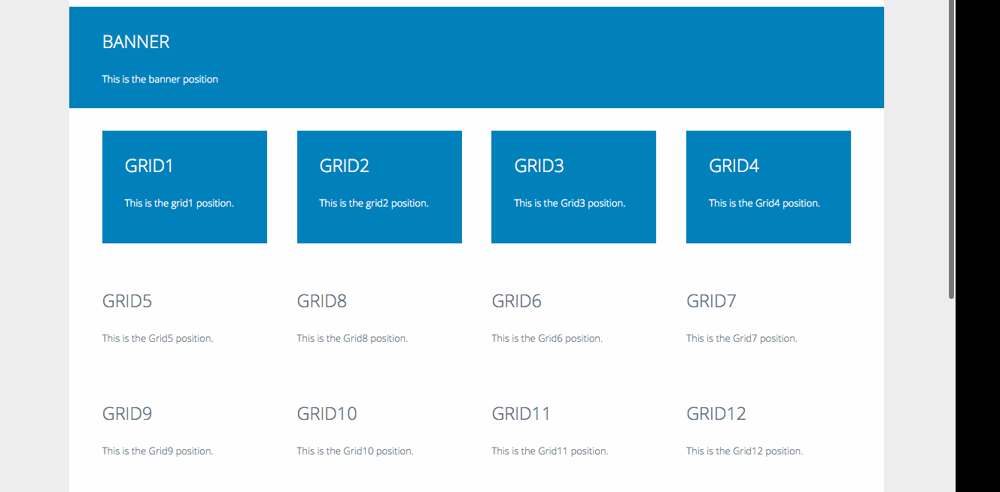
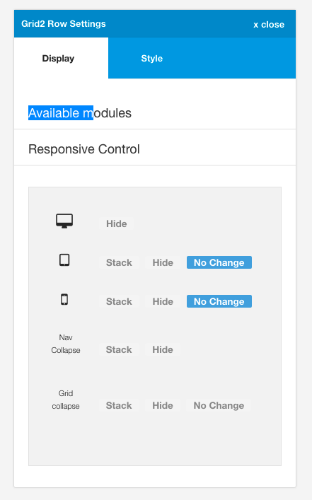
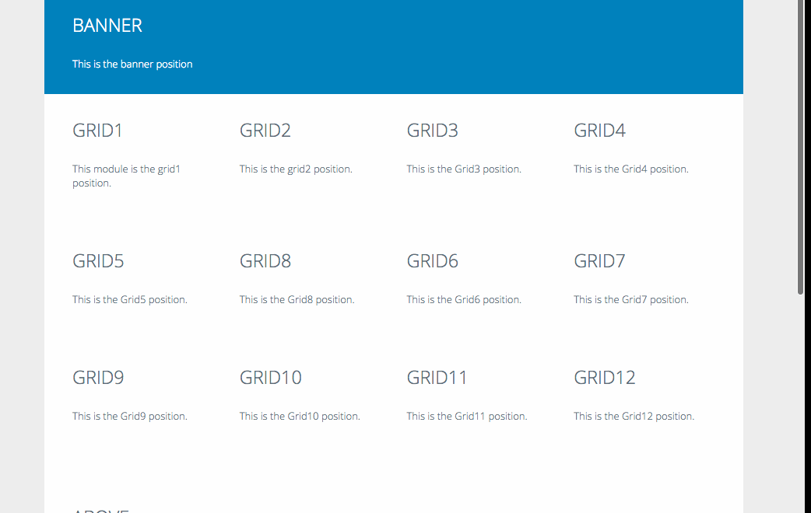

Toggle buttons that determine if a specific row can be seen or hidden at various screen widths, or whether it should be displayed in a stacked layout (all positions are 100% width) or whether the layout widths should override the grid collapse setting.

## Screenwidths

The framework is capable of targeting 5 different breakpoints.

- desktop (any screensize larger than the tablet max width)
- tablet
- phone
- nav collapse (at any screen width below this value the menu will be hidden and revert to the relevant responsive menu option)
- grid collapse (at any screen width below this value the modules in the template will stretch to 100% of the width available.)

The specific px values for these breakpoints are set in the layout > breakpoint panel of the general setting side panel.

## What do the options mean?

## hide

When the hide option is selected it means that the entire row will be hidden at the selected breakpoint.

**Example**

In the example below the grid1 row will be hidden at any value less than the px width assigned to the nav collapse.

**Example**

The example below shows the behaviour of the modules when the grid1 row of modules are set to be hidden below the phone breakpoint.

## stacked

When the stacked option is selected it means that the modules in that row will become 100% of the width of the container space. This option is handy for making some modules stack before the grid collapse breakpoint is reached. 

**Example**

In the example below the grid2 row modules will be made to be 100% width regardless of the width assigned to them in the layout area, at screensizes less than the tablet max-width and greater than the phone max width.

**Note:** If the grid collapse option is greater than the tablet max width in the breakpoints settings then setting these modules to stacked will have no effect, because the modules will already have been stacked given that the screen width is less than the grid collapse px value. 

Using the stacked option is only relevant if you want to target modules in a specific row on screensizes that are greater than the grid collapse value.

## no change

When the nochange option is selected it means that the widths assigned to the module in the layout area will be honoured across all screensizes. This means that on screensizes smaller than grid collapse the modules will not be forced to be displayed in a stacked layout.

**Example**

In the example below the modules published to the grid2 row will honour the widths assigned in the layout tool whether or not the browser is smaller than the grid collapse breakpoint.

**Example:**

The example below shows the behaviour when the grid1 row of modules are set to no change for both phone and tablet breakpoints. The modules in grid2 and grid3 rows are stacked once the grid collapse breakpoint is reached however the modules in the grid1 position maintain their respective widths.

