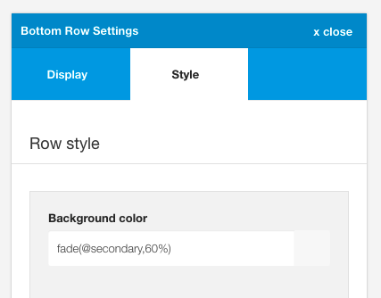

Contains the settings for the specific row. The row is the part of the layout that includes the entire area from the left and right edge of the screen. Setitngs here allow the user to adjust the background colour, image, padding, margin, border and whether or not to use an overlay.

## What part of the layout does the row cover?

Zen Grid Framework themes are based on the display of a number of different rows in the layout. 

Each row contains a specified selection of modules which are surrounded by the following html markup.

	<section id="grid1wrap">
		

			

				

					
 ...

- The section element is the wrapping div for the entire row and marks the area where the row settings apply.
- zen-container is the structural div that determines the width of the content area within the row
- zen-row is the div required to denote the start of the row of content
- zen-spotlight is the div that the container style settings apply to.

## Row vs container area
Visually this can be represented in the following image:

			

## Settings

## Background Color
This setting determines the color applied to the background of the entire row.

**Applying no color**
If you wish to remove any color for this row simply leave this setting blank. If the option is left blank there is no css rendered for this row and the body color or overlay color  will be seen. 

Using the value 'none' or 'transparent' are valid values to be used here however it will result in css being rendered for that div along the lines of #grid1wrap {background:none}

**Using transparent colors** 
It is possible to use the following syntax to render a transparent overlay for the row background. You may like to see the main Backgrounder theme for examples of how we have done this. 

There are two options for applying a transparent color to a row background:

- use the less fade syntax eg fade(#333, 80%) or even fade(@primary, 80%). Using this syntax will result in a colour that is 80% transparency of the specified color.
- Using RGBA colors. It is also possible to specify a transparent rgba color in the form of the following: rgab(0,0,0,0.8). This is the same as adding fade(#000, 80%).

**Example**
The screenshot below shows a transparent value applied to two rows in the Backgrounder theme for the grid6 and bottom rows. It's important to note that the background colour applies only to the area outside of the container as the container style for this theme uses color values for the container background.

The background colors are set as per the following:

**Grid6 row**

**Bottom row**

**Backgrounder primary and secondary colours**

**Note:** This color is used as the overlay color when that setting is enabled in the option below. 

## Background image

The image used for the row background.

This setting provides the option to display a background image for a specified row.

Images in the select box are referenced from the images folder on your server and can either be uploaded via ftp or using the Joomla media manager.

**Example**

The Writer theme uses an image assigned to the banner row.

## Image repeat

Applies the background-repeat rule to the image. This is a standard css rule which uses the following options:

- no-repeat (the image is not repeated)
- repeat (the image is repeated vertically and horizontally)
- repeat-x (the image is repeated horizontally)
- repeat-y (the image is repeated vertically)

## Image cover

Applies the background-size rule when an image is set for the row. 

Options include cover or inherit. 

When using the cover option the background image will be resized so that the image covers the entire area of the div. This means that the image is stretched vertically and horizontally inside the area of the row and maintain the aspect ratio of the image. When this option is selected some parts of the image may not be visible.

This option is designed to be an aesthetic feature and in cases where you want to display key parts of the image across all screen sizes you may need to edit the image or provide further css in the form of media queries to force the image to be shown at certain positions. These kinds of edits are unique to each image that is being used and can not be incorporated in the framework.

## Add overlay above image

When enabled, this option adds a transparent overlay between image and the rows content. This is ideal for controlling the readability of text that is displayed on top of images in the row.

The color of the overlay is referenced by the background colour for the row.
The opacity of the overlay is referenced from the fade value assigned to the overlay fade found in the general settings of the sidebar panel.

**Example**

Using the Writer theme as an example we can see how we can control the colour of the overlay displaying beneath the logo text and above the background image.

**Default - #333 for background color and 60% for the Overlay fade value**

**White - #fff for background color and 60% for the Overlay fade value. The logo color and toolbar text color has also been changed.**

**Primary - @primary for background color and 80% for the Overlay fade value.**

## Row Padding

The row padding option determines the amount of padding applied to the row. This is the space within the row between the container and the edge of the row.

This is the space that will appear around the container content for that row eg the distance between the content and the edge of the row. This option does not increase the space between each row.

## Row Margin

The row margin option determines the vertical margin between each row.

**Note:** When a row is given no margin then any modules in that row will also inherit this class. This is so as to make it easy to create layouts where the content of any modules in that row are flush up against each other.

An example of this can be seen in the One page demo where there is no space between the modules in the grid 5 row.

## Row Border

The row border option applies a border to the row.

**Define the border**

The border element in Zen Grid Themes are a visual representation of the border that will be applied to the row. It is important to note that you need to click on one of the edges of the square box in order to be able to render a border for the row.

Adding a border is done in 4 easy steps.

1. Select which side of the border to target
2. Set the px width of the border using 'px'
3. Select the style of the border eg solid, dashed, dotted
4. Select the colour using the colour picker.

Please note that a border will not render if at least one part of the grey square is highlighted and the border width is supplied.

**Creating a 1px bottom border**

**Creating a 10px full border**

**Creating a 1px border for the sides of the box**

