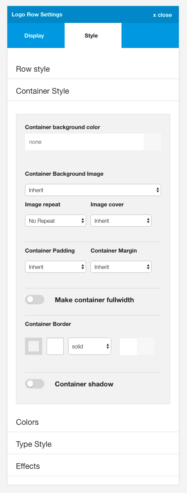

Contains the settings for the container in a specific row. The container is the part of the layout that is inside the row and is restricted by the width set in the template width in the general style section. Settings here allow the user to adjust the background colour, image, padding, margin, border, whether or not to use an overlay apply a shadow on the container and to make the container the full width of the screen.

