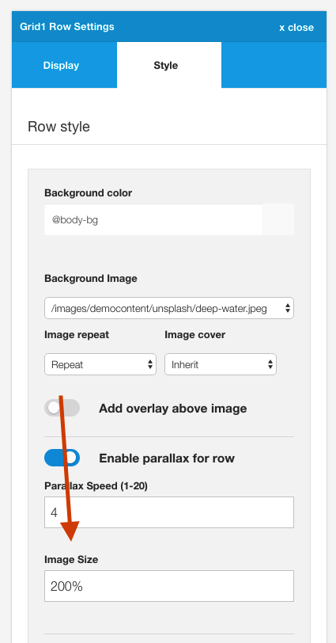

The Build.r template has the capacity to create a parallax effect when using an image for the background.

A parallax effect gives the impression that there are multiple layers of elements on the page and that as the user scrolls the layers scroll at different speeds which creates the parallax effect.

## Example
When the row is at the bottom of the page the top portion of the image is displayed.

However when the user scrolls further down the page the more of the image can be seen, and the row content stays in the same position relative to the row of content.

## How to apply parallax to a row

Applying parallax to a row of content involves the following steps:

#### a. Specify a background image to use.

This is the same setting that determines the background image used for rows.

#### b. Check the parallax radio checkbox

When the checkbox is enabled the parallax effect is applied ot the row. If it is disabled the image is used as a background image without the effect.

#### c. Set the parallax speed

The parallax speed determines the speed that the image scrolls relative to the content. A smaller number refers to a fast speed whereas the a higher number means that the image will move more slowly relative to the content. 

Depending on the aspect ratio of the template and the position that the image is on the page you may need to adjust this setting to avoid the image moving off the screen before the content row comes into the browser window.

Generally images at the top of the page can afford to have a smaller value here whereas images displayed at the top of the screen require a higher value.

#### d. Set the image size

The image size controls the size of the image and how much of the row that the image will cover.

**Images at 100%**

A value of 100% will make the image fill the width of the container.

The image below shows an image set to 100%.

However as the user scrolls there is a gap in the display where the image doesn't display.

This gap will be greater if the parallax speed is set to a lower value or smaller if the speed is set to a higher value.

**Images at 220%**

To cover the gap it is possible to increase the image size so that it covers the area that is shown as the user scrolls.

As you can see there is no shortfall on the page when the image is enlarged as the user scrolls up the page, however the image quality is reduced and less of the image is seen in the viewport.

**A balancing act**

Finding the right balance of speed and image size will depend on the size and aspect ratio of your image, the height of the area that the parallax image is assigned to, and your user's screensize. 

#### e. Click Save

Save your template settings to save your changes and make them visible on your website.

## Controlling the minimum height of the parallax row.

The minimum height of the parallax row is determined by the settings under the Parallax toggle in the General Settings sidebar.

This setting determines the minimum height assigned to all parallax rows on your website.

## Disabling the parallax effect based on screensize

The parallax effect can be disabled at a screensize specified in the General settings side panel.

This setting is useful for removing the effect when the screen changes to a size that it makes sense in your design to no longer apply the parallax effect. 

**Note** if you want to keep the effect enabled regardless of the screensize simply set this value to 0. Parallax will continue to be disabled on ios devices (see note below).

As an example if your images appear well on large screensizes however there is too much gap on smaller screens you can add a px width or screen size variable to force the full image to display.

Variables for screensizes include:

- @grid-collapse
- @nav-collapse
- @tablet-max-width
- @phone-max-width
- or any px value

When screens are below the width specified here the image is forced to use the default image size option.

This setting can be used to make up any shortfall that the image has when it comes to covering the area that it is set to display in. If there is a gap between the image and the row of content increase this value (as a %) to cover the area required eg 220%.

Images that have an aspect ratio that are close square will generally not have an issue with a shortfall.

## Parallax is disabled on IOS devices

The parallax effect is disabled across all ios devices. IOS devices such as ipads and iphones do not have a reliable way of measure scroll amounts and as such parallax and other fixed element behaviour tends to be choppy. As such the effect is disabled for all IOS devices, however it is not disabled for Android devices. 

Please note that the effect may still be disabled for Android devices if your device size is below the value specified in the "Disable below this width" value.

## Developer notes

#### The Markup

When the parallax effect is enabled the following attributes are applied to the section of the row the parallax is assigned to:

	data-speed="3"
	data-type="background"

And the style information from the settings is applied as follows:

	background-size: 220%; 

The background position is calculated via the javascript.

	background-position: 50% -286.667px;

#### The Javascript

The javascript for the parallax can be found in the 

	zengrid/libs/zengrid/js/framework.js

	var isMobile = {
		   
		    iOS: function() {
		        return navigator.userAgent.match(/iPhone|iPad|iPod/i);
		    }
		};
		
		if(!isMobile.iOS()) {
		
			// Uber Easy Parallax
			jQuerywindow = jQuery(window);
				 
				 jQuery('section[data-type="background"]').each(function(){
				     var jQuerybgobj = jQuery(this); // assigning the object
				                    
				     jQuery(window).scroll(function() {
				                    
						// Scroll the background at var speed
						// the yPos is a negative value because we're scrolling it UP!								
						var yPos = -(jQuerywindow.scrollTop() / jQuerybgobj.data('speed')); 
						
						// Put together our final background position
						var coords = '50% '+ yPos + 'px';
				
						// Move the background
						jQuerybgobj.css({ backgroundPosition: coords });
						
				}); // window scroll Ends
			});
		} else {
			
			$('html').addClass('is-ios')
		}

#### Less
The .less rules for the parallax effect can be found in the following file

	zengrid/libs/zengrid/less/_parallax.less

	// Parallax
	[data-type="background"] {
		min-height: @p_minheight;
		
		@media screen and (max-width:@p_disable) {
			background-position:center !important
		}
	}
	
	.touch {
		[data-type="background"] {
			background-position:center !important
		}
	}