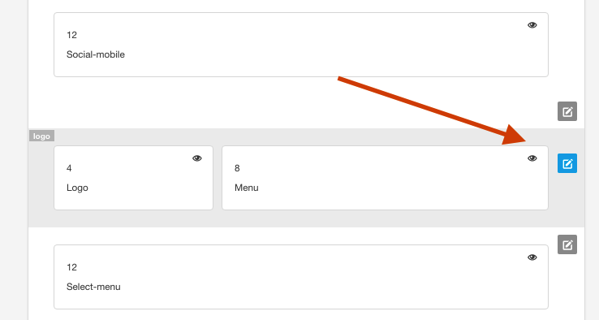
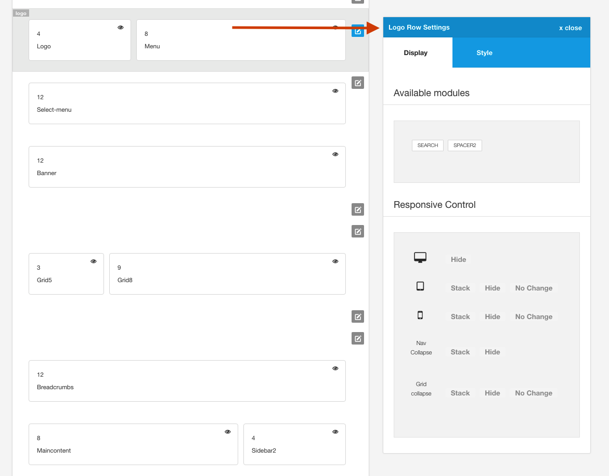

The settings panel for specific rows or groups of modules are shown when the user clicks on the edit pencil for that specific row.

**The Row settings panel allows the user to control specific responsive settings, colours, margins, paddings etc for that specific row.**

## How to activate the Row settings

1. Click on the pencil in a row.

2. Once the user has clicked on the icon the settings available for that row will appear
   

## Some settings are not available for some rows.

In general the row settings apply to all rows in the template however there are some important cases where it has made sense to remove them.

**Note:** Developers can see the settings that have been removed from the interface by looking in the settings/themer-exclude.json file.

The default them ships with the following row styles removed:

	{
		"0":"abovecontent-container-fullwidth",
		"1":"belowcontent-container-fullwidth",
		"2":"top-left-container_padding",
		"3":"top-left-container_margin",
		"4":"top-right-container_padding",
		"5":"top-right-container_margin"
	}

In order to remove additional items from the row settings simply add the parameter you wish to remove in the json object. Please ensure that the last item in the list does not container a trailing comma as per the example above.