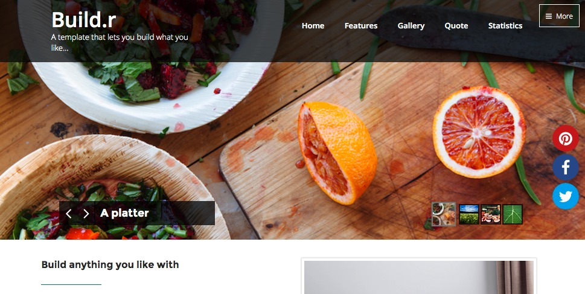
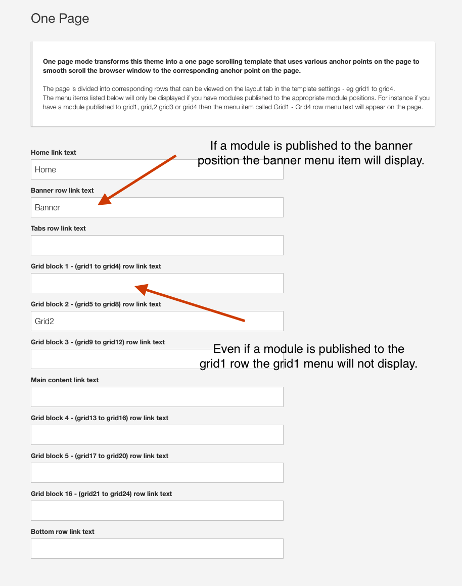
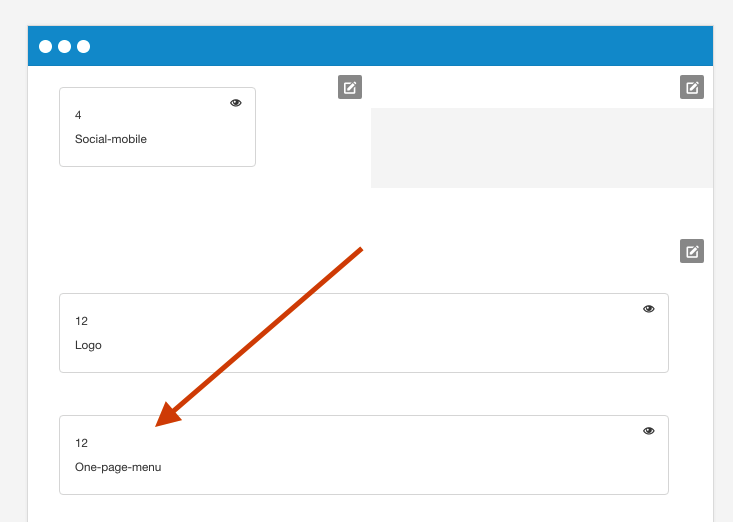

## What is the one page menu?
The one page menu option transforms your main navigation into a one page menu system which allows the user to smooth scroll to various anchor points on the page. 

The <a href="http://bambootheme.com/showcase/apr16/home/one-page">onepage theme</a> is an example of the one page functionality in use on the page

When the links in the menu are clicked, the page scrolls to the respective row of modules.

## How are links created?
The menu is automatically created when you add a module to a specific position **and** the menu title for that position is not blank in your template settings. 

## Position of one page menu
The implementation of the one page mode in zgf5 themes differs to ZGF5 in that the one page menu position is determined via a layout block. This also means that the one page menu and a main menu can be displayed on the page at the same time.

To add the one page menu to a page simply and the menu to the layout and drag the One-page-menu block to the row you want it to appear in. 

The One page menu block is found in in the menu row of available modules when it is not currently being used in the layout.

Menu items link to rows of modules
----
Each Zen Grid Framework v5 (ZGF5) theme is divided into a number of different rows of modules. The typical layout for these modules is as follows:

- top
- header
- menu
- banner
- grid-block-1 (grid1 - grid4)
- grid-block-2 (grid5 - grid8)
- grid-block-3 (grid9 - grid12)
- maincontent
- grid-block-4 (grid13 - grid16)
- grid-block-5 (grid1 - grid4)
- grid-block-6
- bottom
- footer

