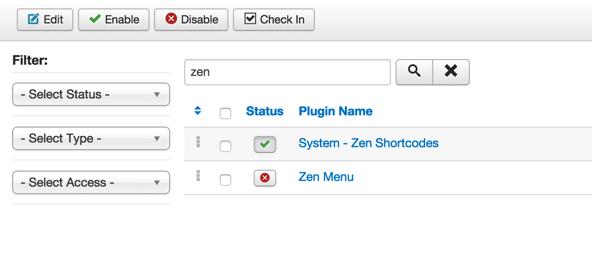
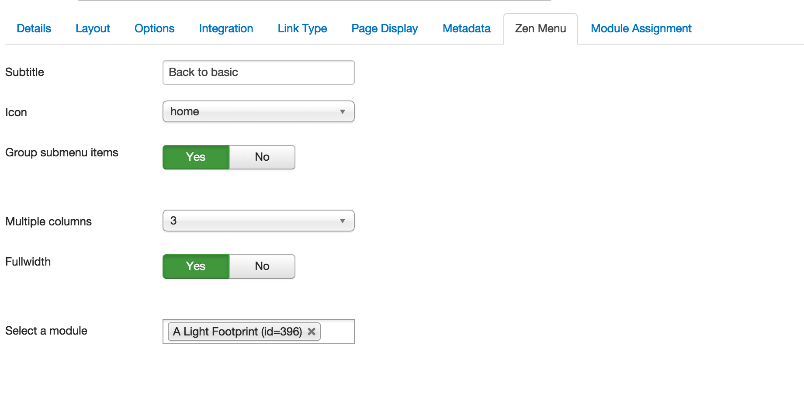
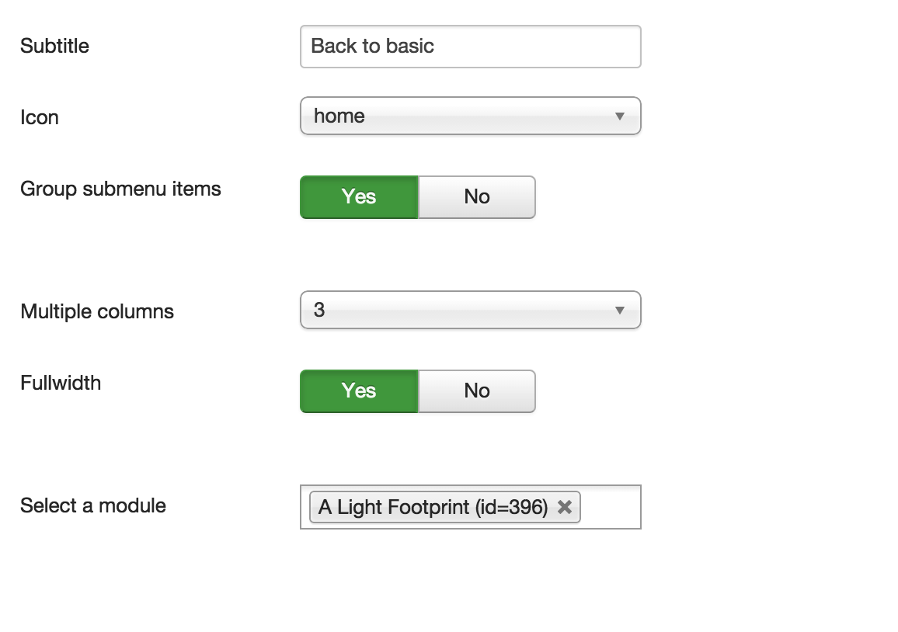

Megamenu functionality such as displaying a module in the menu, icons in the menu titles or multiple columns are implemented via the Zen Menu plugin.

The zenmenu plugin is a Joomla system plugin that adds mega menu functionality to your Zen Grid Framework v5 based theme.

The plugin utilises special markup in your themes html overrides which means that you can add multiple columns, icons, subtitles and more to your menu using the core Joomla menu module.

Installing the Zenmenu plugin
-----
Installation of the Zenmenu plugin is performed via the Joomla extensions manager. 

The file can be downloaded via this link - <a href="http://joomlabamboo.com/index.php?option=com_docman&task=doc_download&gid=694&Itemid=">Download here</a>.

Publish the plugin
----
The plugin is not publish by default after installation so you will need to publish the plugin via the extension manager. Navigate to the the extensions > plugin manager and type "zen" into the search box. The Zen Menu plugin should appear in the filtered list. 

  
  
Click on the red status icon next to the plugin name to ensure it is published.

Edit a menu item
----

To see the menu params for the zenmenu plugin navigate to the menu manager and edit the menu item you wish to add mega menu functions to.

Click on the Zen Menu tab in the menu manager
----

Menu options
----

### Subtitle
The subtitle option adds subtext to the menu item. 
The text is wrapped in a span tag with the class .zen-menu-caption.

### Icon
Select from any of the icons available in the Font Awesome library. See the Font Awesome website for a full list. <a href="http://fortawesome.github.io/Font-Awesome/">Visit Font Awesome</a>

In order to have Font Awesome icons display in your menu you need to be including the Font Awesome library in your template settings or via the Zen Shortcode plugin.

Please read the <a href="http://docs.joomlabamboo.com/zen-grid-framework-4/theme/working-with-font-awesome.html">working with Font Awesome</a> documentation for more information.

### Group sub menu items
This option displays any of the sub menu items from the current menu item without the need for the user to hover over the parent. When this option is disabled the menu behaves as a usual dropdown menu does - the sub menus are only shown when the user hovers over the parent.

When this option is enabled the child items are automatically displayed without the need to hover over the parent.

This option is not suitable for top level menu items and should only be added to sub or sub sub menu parent items.

### Multiple columns
The multiple column option turns any grouped sub menu items into a multiple column menu. Select to display the menu in up to 4 columns in the menu. 

This option is not applicable to ungrouped menu items.

### Fullwidth
This setting displays any child items in a full width menu that spans the entirety of the navigation div's width. This may or may not span the full width of the container depending on the way the theme is set up to display.

This setting can only be applied to parent items.

### Select a module
This setting adds a module to the menu item. The module is selected by name in the dropdown list and is then displayed below the menu title of the item the module is being assigned to.

How to add a login module to your mega menu
---

Via the Zenmenu plugin it is possible to add a login module to your site's main navigation. To do that follow these steps:

1. Create a text separator menu item called Login (this can be found in the system links accordion when creating a new menu item)
2. Next create a second text separator menu item, you can name this anything you like but in this case we will call it login form
3. On the detail edit screen ensure that the parent item option is set to use the newly created login menu item.
3. On the zenmenu tab, disable the option to show the item title. This will hide the text "login form" from appearing above your login form.
4. Lastly where it says "select a module" on the same zenmenu edit screen type in the name of the module you wish to publish to this section.
5. Now press save.

If you have followed the steps outlined above you should now see a new menu item called login in your top menu and when the user hovers over the menu it should show a login form in the drop down menu.