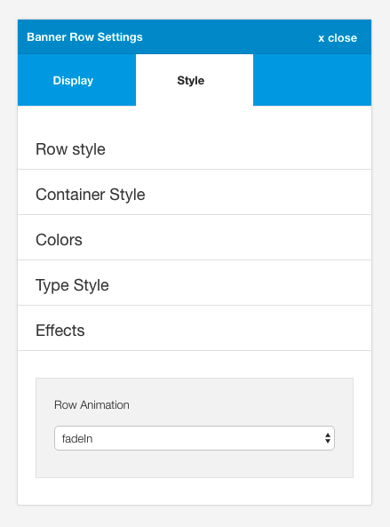

The row animation makes it possible to reveal content on the page via the use of fancy effect such as bounce in, fadeIn etc. Content for each row is revealed when it becomes visible - either on page load or as the user scrolls.

The row animation setting can be found in the effects group, in the style tab for the row setting that you want to target.

## Animations available

Animations include:

- bounceIn
- bounceInLeft
- bounceInRight
- bounceInUp
- fadeIn
- fadeInDown
- fadeInDownBig
- fadeInLeft
- fadeInLeftBig
- fadeInRight
- fadeInRightBig
- fadeInUp
- fadeInUpBig
- flash
- flip
- flipInX
- flipInY
- lightSpeedIn
- pulse
- rollIn
- rotateIn
- rotateInDownLeft
- rotateInDownRight
- rotateInUpLeft
- rotateInUpRight

## Developer notes

- Wow.js is used to trigger the animation events. <a href="http://mynameismatthieu.com/WOW/">Visit website</a>
- The wow.js file can be found in the js/libs/ folder.

- The animate.css less library is a fork of the original animate.css library and can be found <a href="https://github.com/machito/animate.less">here</a>.

- The animate less files can be found in the zen/libs/zen/animate folder.	

If the animation library is enabled and your chosen animation has been compiled to the theme's css file it is possible to use the animation in your content or template using classes such as:

	zen-animate fadeInUpBig animated