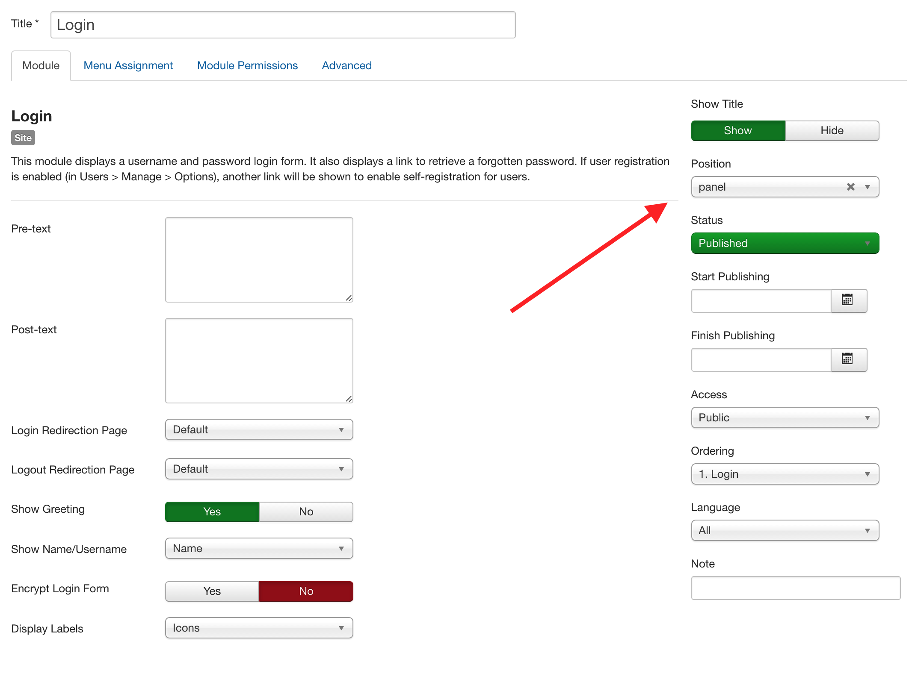
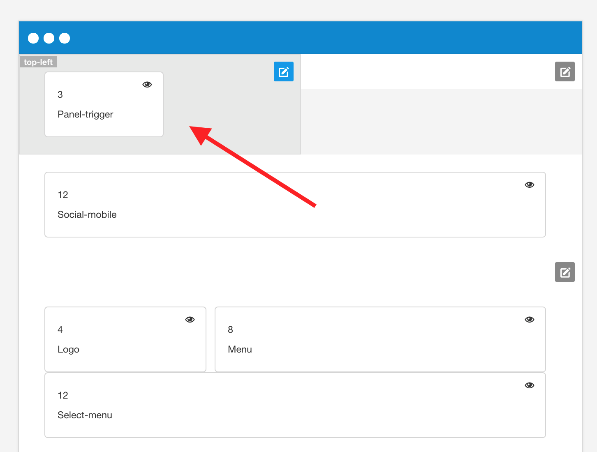

## Example of the hidden panel

## How to enable the hidden panel
The hidden panel is rendered on the page when both of the following conditions are met:

1. You publish any module to the panel position.

2. You have the panel trigger layout block added to the template layout int he template settings.

## Theming the hidden panel

 
