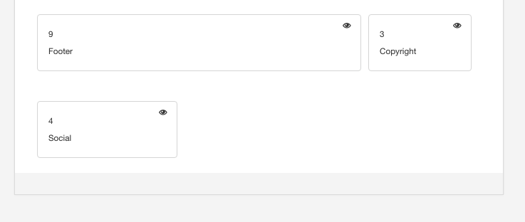
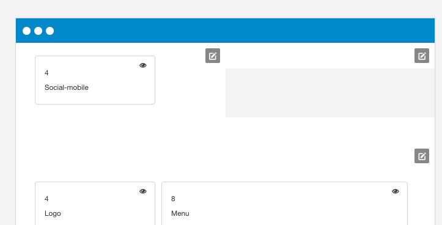

### (Article in progress)
This article is incomplete and will be updated shortly.

## Determining the position of the social icons

There are two blocks available in the layout tool that can be used to control the position of the social icons. 

- Social icons
- Social Icons mobile

Both of these blocks can be used in any position and at any screen size. The social icons mobile is named with the mobile word to help users locate the block they have used for the mobile display, however the block will appear at any screensize.

