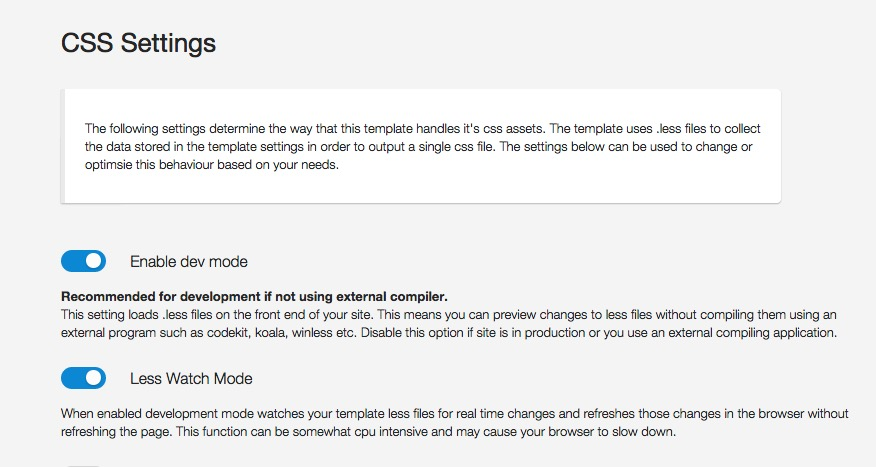

### What is Development Mode

**Development mode enables the direct loading of .less files in your template.**

Browsers traditionally only load stylesheets in the form of .css files. 

However Development mode makes it possible to load .less files directly in the browser, which makes it possible for developers that are used to working with the .less language to work directly with the template .less files without requiring an external app to compile the less to css.

When devmode is enabled the template's css files are not rendered on the page, and the templates less files are loaded.

## Using Devmode with Child Themes

Buildr is shipped with a default vanilla variables file and if you are using a child theme with Buildr, you need to follow these extra steps in order to replicate the Child theme display.

**Step 1 -** Create a new variables file called my-variables.less in the templates/Buildr/less folder.
**Step 2 -** Locate the file called variables-generated-devmode.less and copy it's contents to the my-variables.less file.

This file is automatically generated when the Buildr template settings are saved. It contains the output of all of the relevant theme variables that are currently set in the template settings.

**Step 3 -** In your template.less file add the reference to the new variables file as per the following:

In the template.less file change this:git

	@import "variables.less";
	@import "mixins.less";

to this:

	@import "variables.less";
	@import "variables-devmode.less";
	@import "mixins.less";

**Step 4 -** In your child theme less file, located here: templates/buildr/less/child/[my-child-theme].less add a reference to the template's main variables, mixins and your newly created variables file.
   
Add the reference to these files in the child theme .less file. eg open child/grid4.less and add the following reference at the top of the file:
@import "../variables.less";
@import "../variables-devmode.less";
@import "../mixins.less";

**Please note:** When you are using devmode and developing your own theme it is recommended to make your own child theme in order to prevent data loss when updating your template.