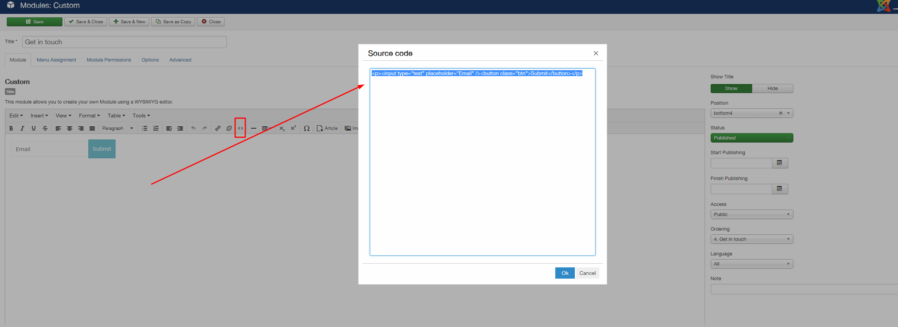

## Description of elements

This template is initially composed of items:

1- Logo
2- Menu
3- Menu Canvas
4- Slideshow
5- Social Icons 

## Logo

Custom html module published to the logo position.

### The position of the logo in the template follows the image below:

### You can adjust some of the logo settings. But for this, your logo should be composed of text.

## Social Icons

Social icon block generated by the template.

### The social module is configured according to the image below:

### And the responsive social module is configured according to the image below:

## Offcanvas trigger

Offcanvas trigger generated by the template.

### Offcanvas Position

The offcanvas trigger is positioned in the template via the layout tool.

### Offcanvas Settings

Features such as the button style for the offcanvas trigger, the side of the screen the offcanvas opens on, when it becomes visible and the text for the trigger are controlled in the menus > offcanvas panel of the template.

### Offcanvas button color

The color of the offcanvas button is controlled in the row settings panel for the top-right position. The btn-empty style inherits the color set in the colors section of the top-right row settings panel.

## Menu Top

#### This menu is controlled by a menu-type module and inserted in the position "menu".

### This module is available in the position of the temple according to the image below:

### You can also control some features of this module by going to the menu inside the template:

### You can also adjust some functions of the menu, such as animations, alignment and others by going to the dropdown menu in the template:

## Slideshow

### This menu is controlled by a zentools module and inserted in the position "banner".

this module is customized according to the image below:

## Content

#### This menu is controlled by a module type custom and inserted in the position "grid5".

## Filter

#### This menu is controlled by a module zentools and inserted in the position "grid8".

### The configuration of this module is:

###  For this module to work, you must insert the 'no-margin' class in the 'Advanced Settings' tab.

### The content of this module is fed by the articles indicated in the tab content field 'Content Selection'.

## Frequently Asked Questions

#### This menu is controlled by a module zentools and inserted in the position "grid17".

### The configuration of this module is:

### The content of this module is fed by the articles indicated in the tab content field 'Content Selection'. 

## Latest Gallery

#### This menu is controlled by a module zentools and inserted in the position "grid18".

### The configuration of this module is:

### The images of this module is fed by the folder images indicated in the field "Select a folder". 

## Theme Overview

#### This menu is controlled by a module Skillset and inserted in the position "grid21".

### The configuration of this module is:

## By the Numbers

#### This menu is controlled by a module Skillset and inserted in the position "grid24".

### The configuration of this module is:

## Menu About Us

#### This menu is controlled by a module Custom and inserted in the position "bottom1".

### The configuration of this module is:

To use other icone access the menu that already installed as display content of the template: "Features > Tools > Zen Shortcode.

Each menu you should link using the text editor.

## Location

#### This menu is controlled by a module Custom and inserted in the position "bottom2".

### The configuration of this module is:

## Legal

#### This menu is controlled by a module Custom and inserted in the position "bottom3".

### The configuration of this module is:

To use other icone access the menu that already installed as display content of the template: "Features > Tools > Zen Shortcode.

Each menu you should link using the text editor.

## Get in touch

#### This menu is controlled by a module Custom and inserted in the position "bottom4".

### The configuration of this module is:

Exemple in the template:

      
<input type="text" placeholder="Email" /><button class="btn">Submit</button>

## Footer Menu

Joomla menu published to the footer position

## Footer Social Icons

Zensocial module published to the footer position

## Footer logo and text

Custom html module published to the footer position

## Recent News Module
The recent news module is an instance of the Zentools2 module displaying Joomla content using the list layout.

#### This menu is controlled by a module zentools and inserted in the position "offcanvas".

### The configuration of this module is:

### The content of this module is fed by the articles indicated in the tab content field 'Content Selection'. 