## Description of elements

## Logo

Custom html module published to the logo position.

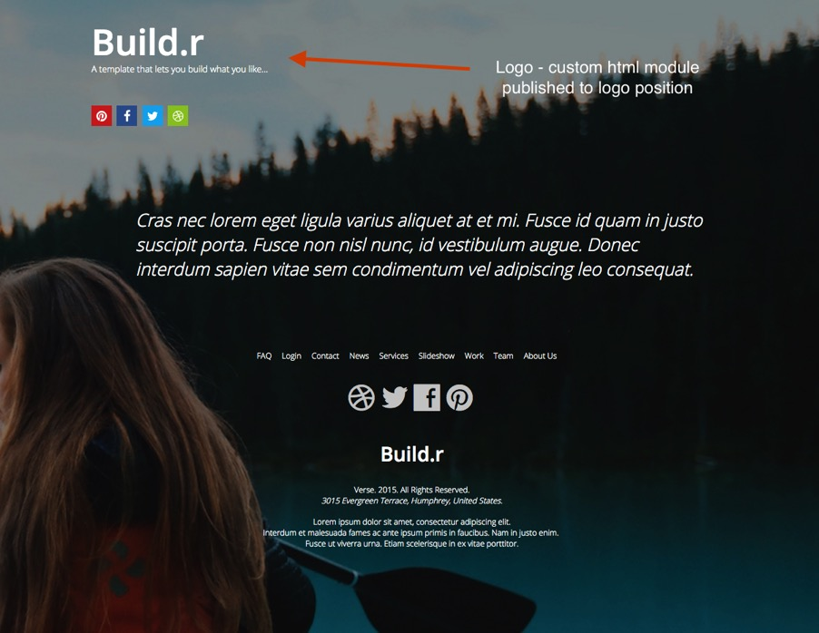

## Social Icons

Social icon block generated by the template.

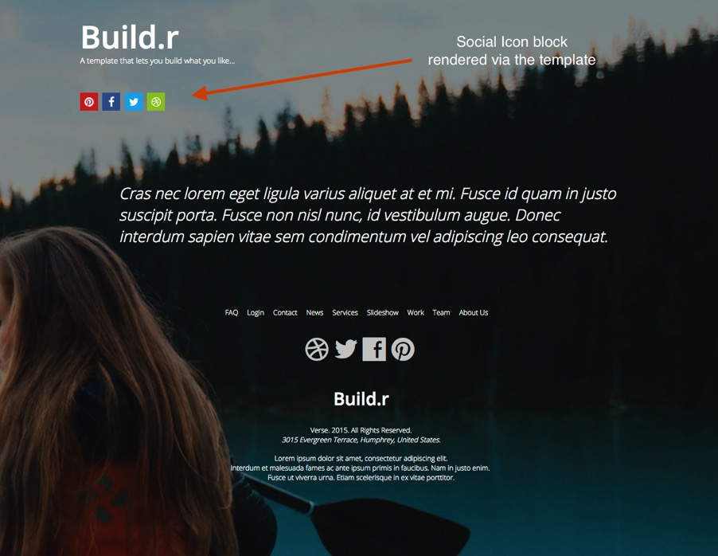

### The Position of the social icons are controlled in the templates layout tool.

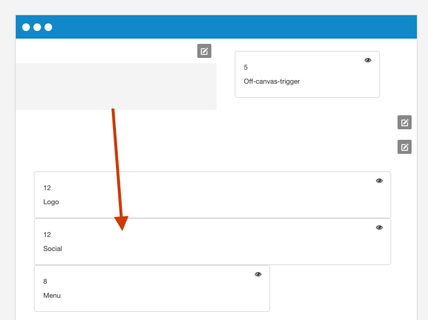

### The display of the social icons is controlled in the general settings sidepanel.

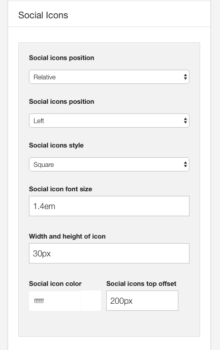

## Offcanvas trigger

Offcanvas trigger generated by the template.

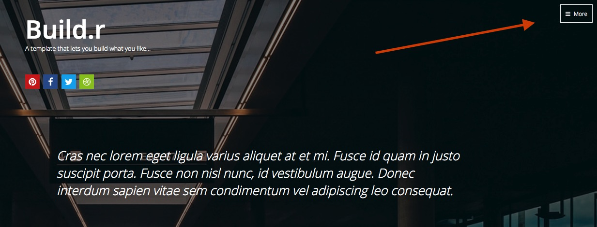

### Offcanvas Position

The offcanvas trigger is positioned in the template via the layout tool.

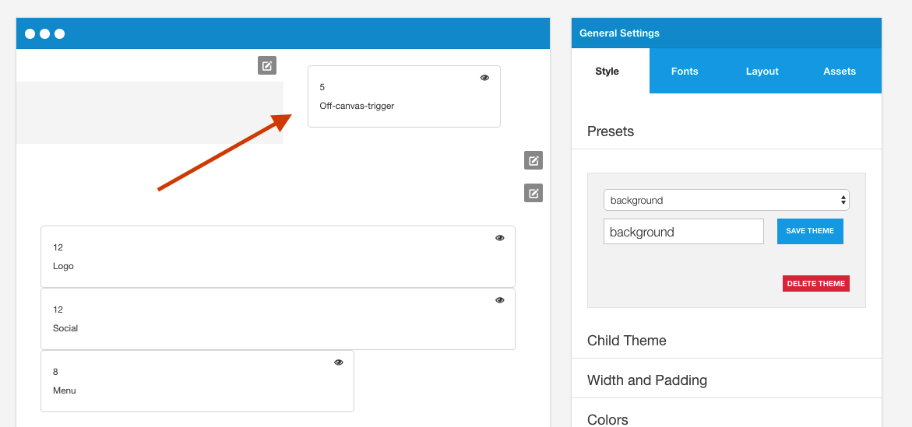

### Offcanvas Settings

Features such as the button style for the offcanvas trigger, the side of the screen the offcanvas opens on, when it becomes visible and the text for the trigger are controlled in the menus > offcanvas panel of the template.

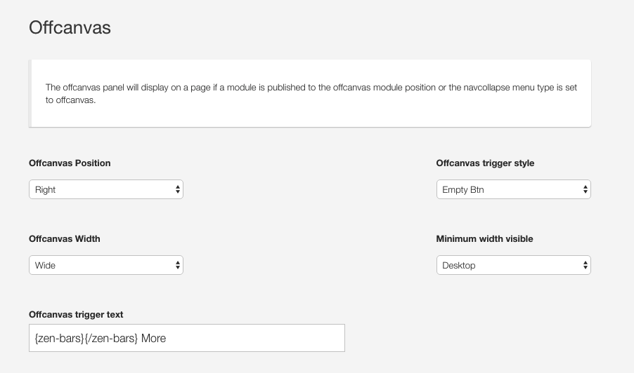

### Offcanvas button color

The color of the offcanvas button is controlled in the row settings panel for the top-right position. The btn-empty style inherits the color set in the colors section of the top-right row settings panel.

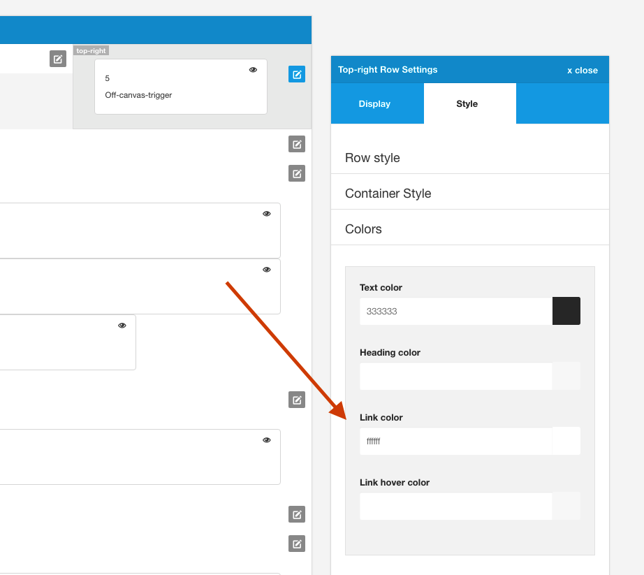

## Content

Content from an article in the Joomla content manager.

## Footer Menu

Joomla menu published to the footer position.

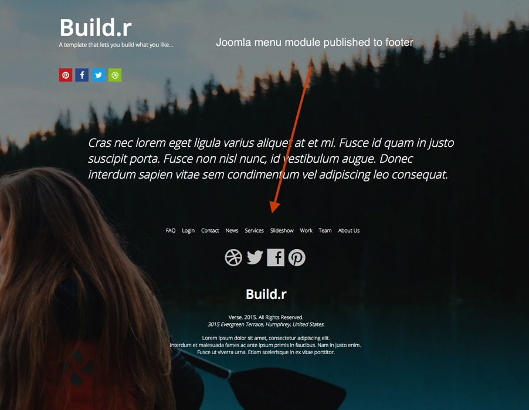

## Footer Social Icons

Zensocial module published to the footer position.

## Footer logo and text

Custom html module published to the footer position.

## Offcanvas accordion menu

The menu in the offcanvas position is automatically rendered from the menu module. 

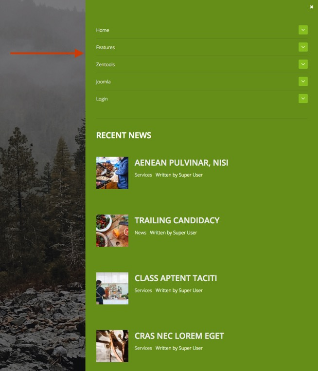

The Offcanvas menu is set to display on the screen and at all screensizes because of the following criteria.

**Navcollapse Breakpoint**
The navcollapse breakpoint is set to a very high number which means that the collapse menu will always be displayed regardless of the screensize.

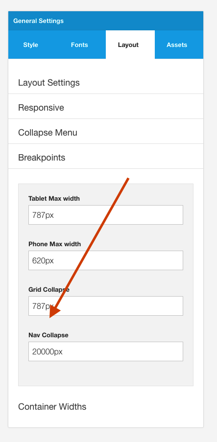

**Menu Module in the layout tool**
The menu block is in the layout tool, however it will never display because the navcollapse breakpoint is set so high.
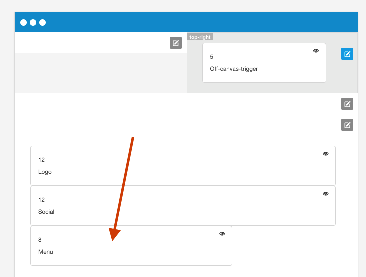

**Collapse menu set to display offcanvas**
The collapse menu type is set to use the Offcanvas panel.
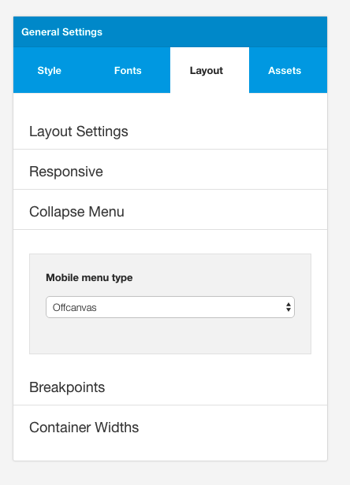

## Recent News Module
The recent news module is an instance of the Zentools2 module displaying Joomla content using the list layout.

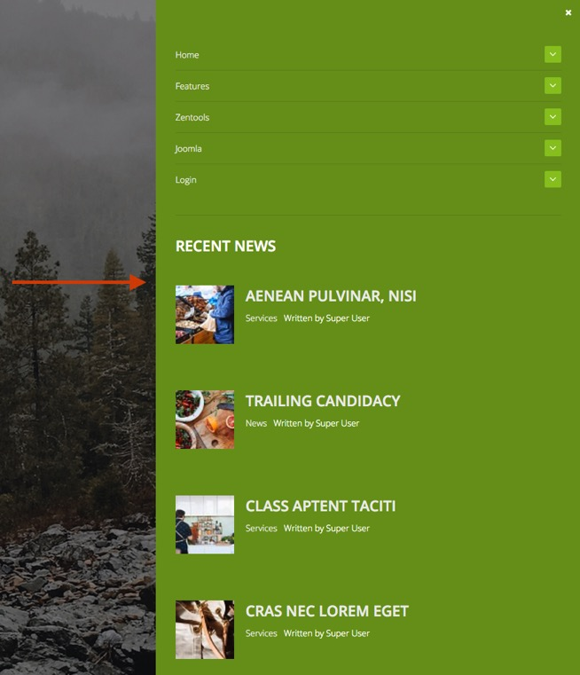

### Zentools2 Settings

**Module**
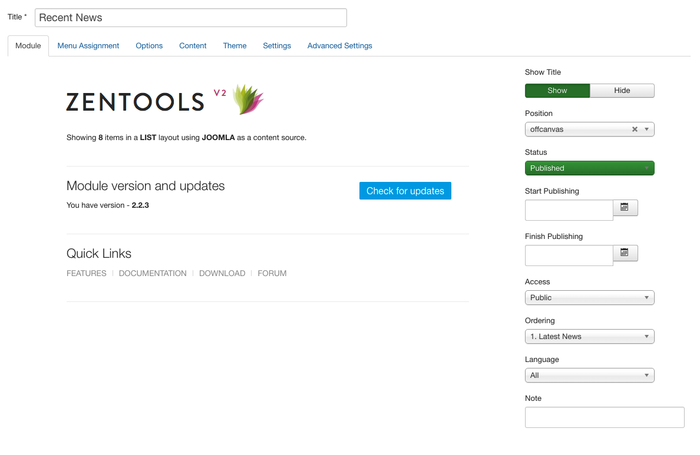

**Options**
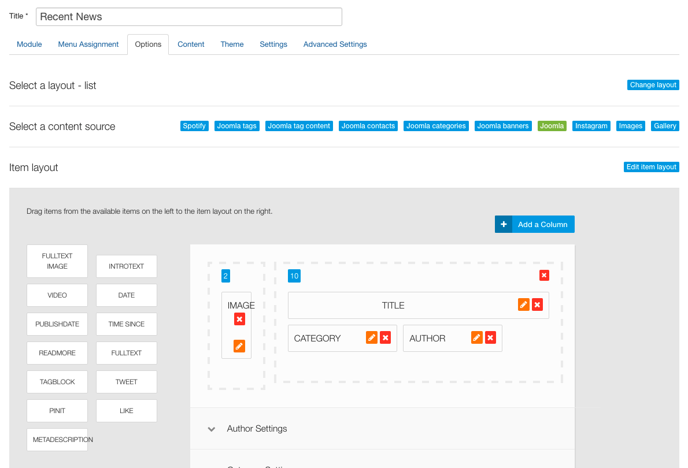

**Content**
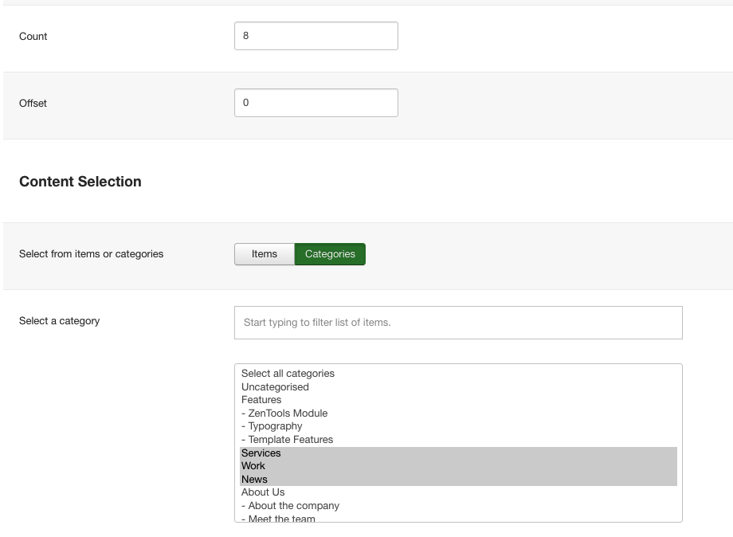