The Writer theme uses the Writer preset. To apply the Writer preset follow the instruction on the <a href="../recreating-the-demo">recreating the demo page</a> and select the preset for the writer theme.

The Writer theme is a simple design that shows the highlights the ability to add a spacer element in order to add white space in the layout. 

## Description of elements

## Toolbar row

The logo and menu are positioned in the toolbar row.

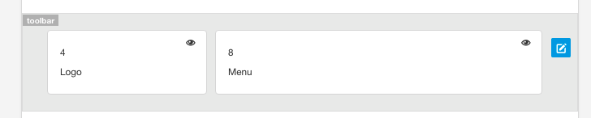

The row is given the padding class.

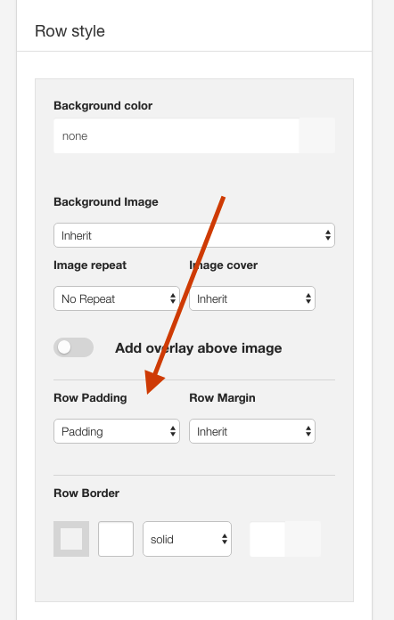

The container is given the vertical padding class to add space to the logo.

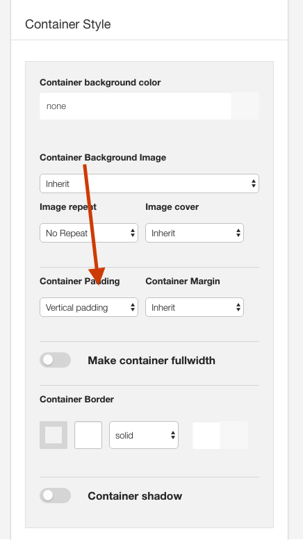

The toolbar is a fixed element that is automatically fixed to the top of the page. Please see the <a href="../layout/fixed-positions">documentation on the fixed elements</a> for more information.

## Logo

This is a custom html module published to the logo position.

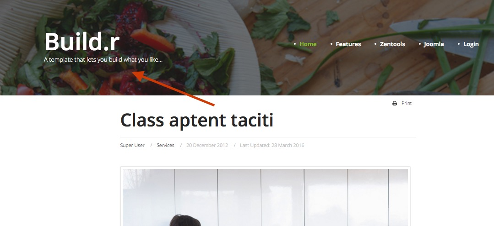

**Logo Font**

The font used for the logo is Rochester.

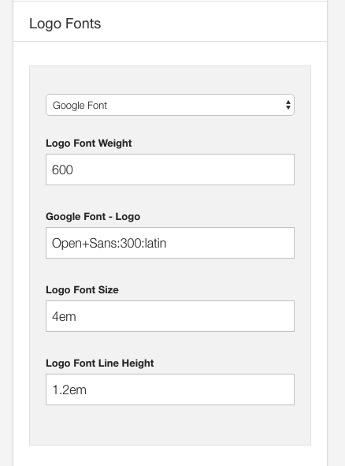

**Logo position**

The logo is placed in the toolbar row in the layout tool.

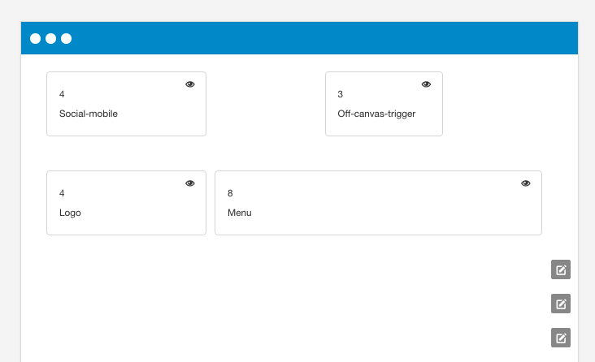

**Logo color**

The logo color is defined in the logo area of the general settings side panel.

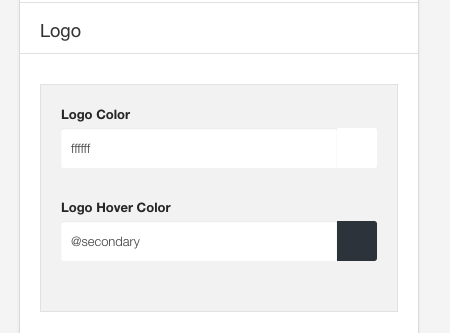

## Banner row

The image underneath the logo is the background image applied to the banner row via the Banner row settings. 

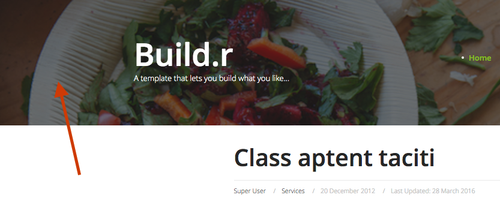

**Settings for the banner image**

The image underneath the logo and menu.

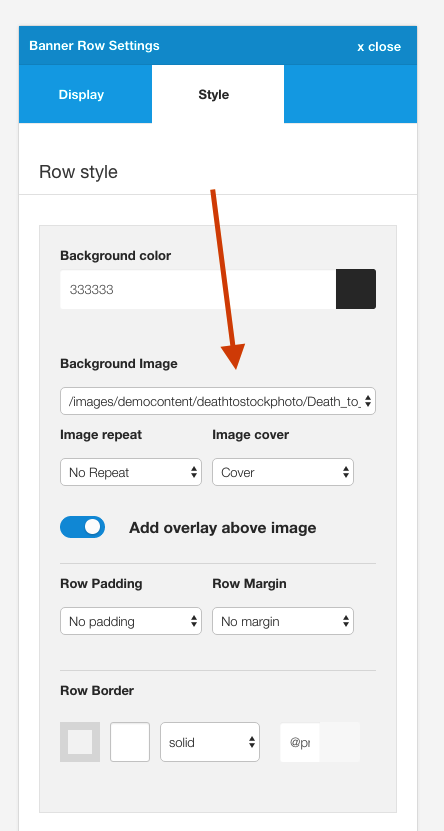

**Banner overlay**

The dark overlay on top of the image is set in the banner row settings. The color for the overlay is taken from the background color while the overall transparency of the overlay is inherited from the Background overlay value.

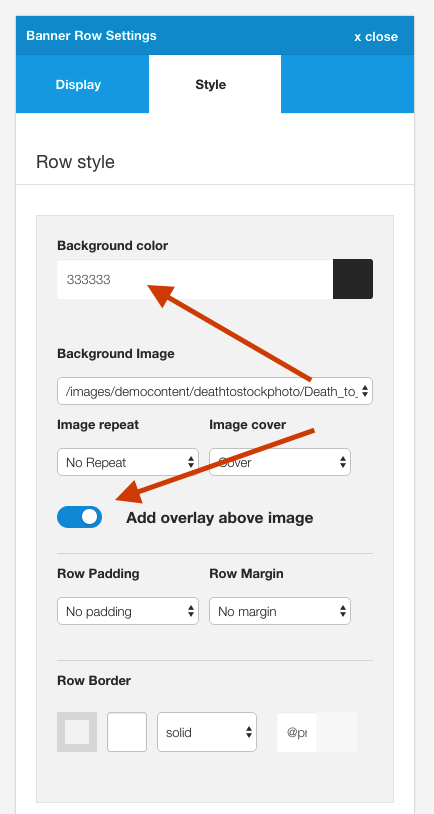

**Banner padding**

The banner row is given no padding and no margin classes for the row margin and padding.

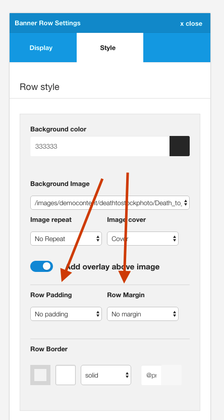

## Main content area

The Writer theme uses a spacer element in the main content area to force the content block into the middle of the page.

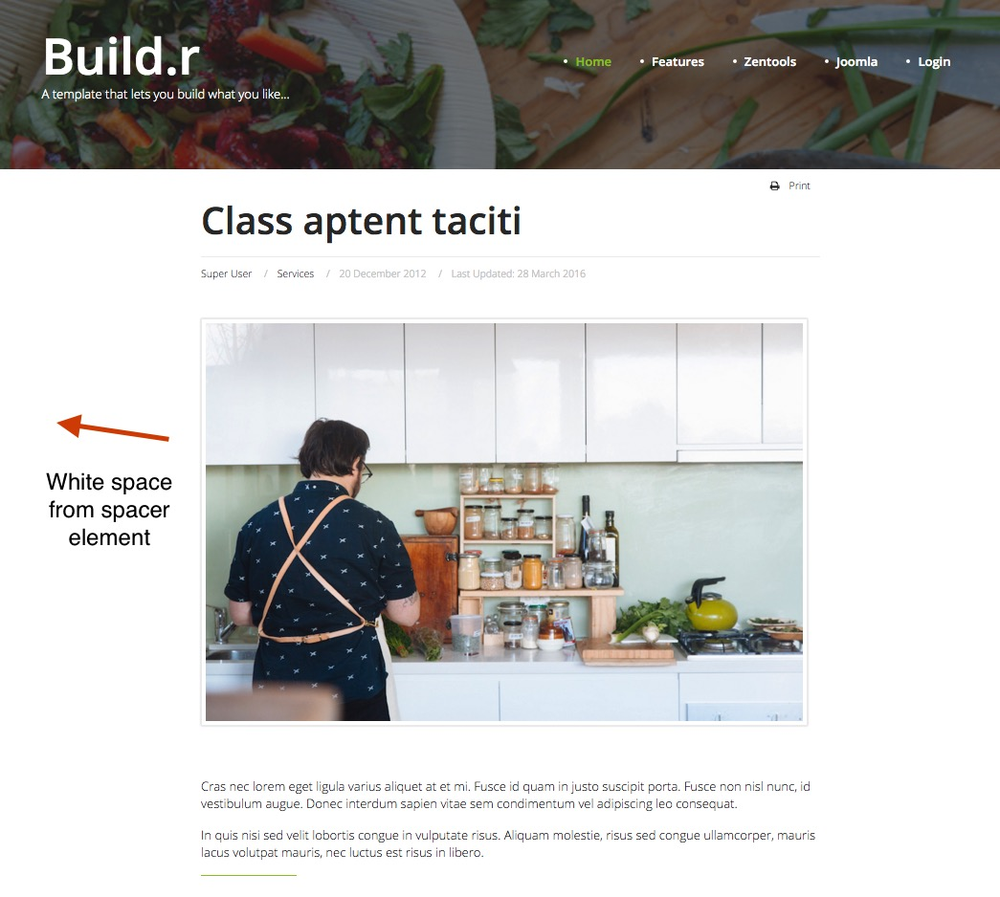

### Spacer used in layout block

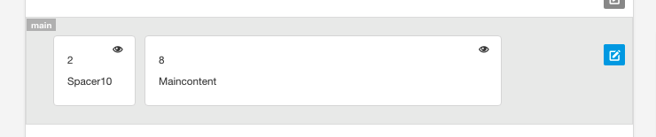

Spacer elements are automatically hidden on screens below the grid collapse value.

## Footer Area

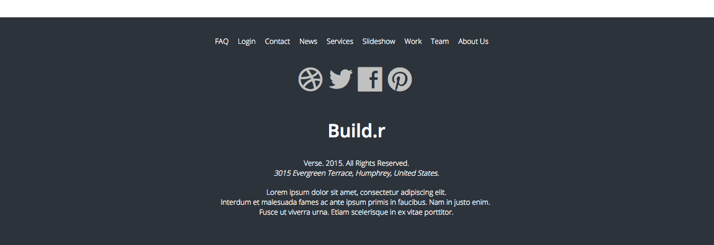

- Joomla menu published to the footer position
- Zensocial module published to the footer position
- Custom html module published to the footer position

## Offcanvas trigger

Offcanvas trigger generated by the template.

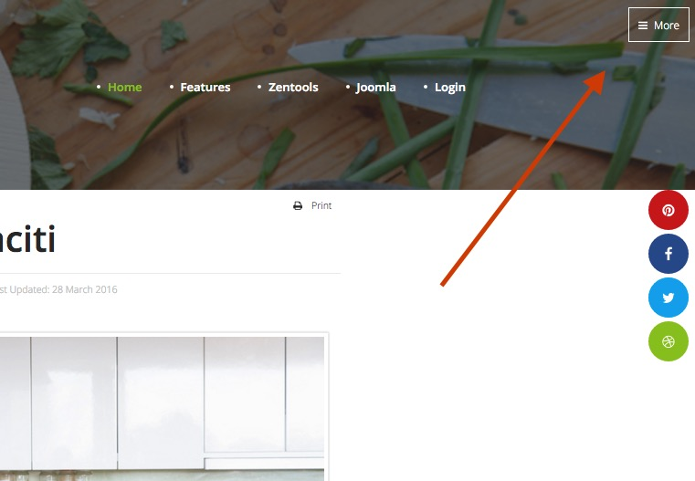

### Offcanvas Trigger Position

The offcanvas trigger is positioned in the template via the layout tool and is placed in the top right position.

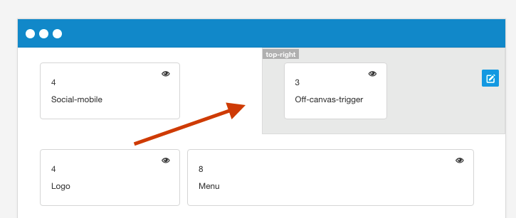

### Offcanvas Settings

Features such as the button style for the offcanvas trigger, the side of the screen the offcanvas opens on, when it becomes visible and the text for the trigger are controlled in the menus > offcanvas panel of the template.

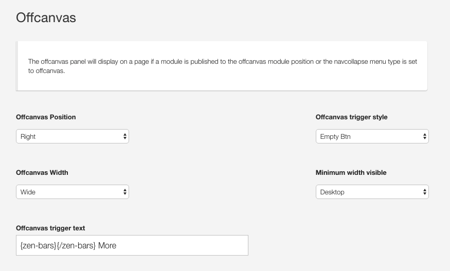

### Offcanvas button color

The color of the offcanvas button is controlled in the row settings panel for the top-right position. The btn-empty style inherits the color set in the colors section of the top-right row settings panel.

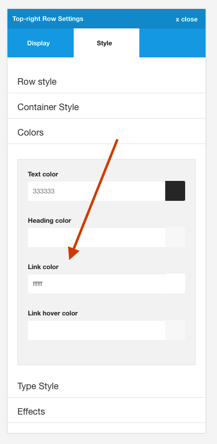

## Social Icons

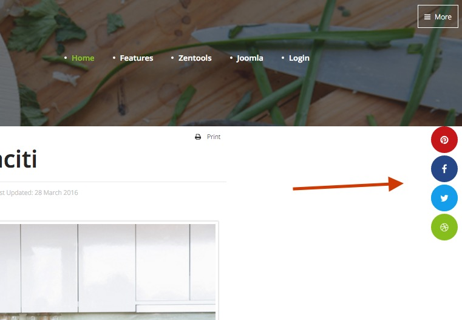

The Social icons are generated from the template.

The Social icon block is best added to the debug position.

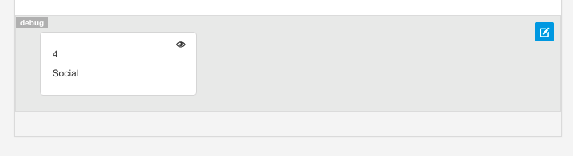

The settings for the icon use the fixed right position and round style.

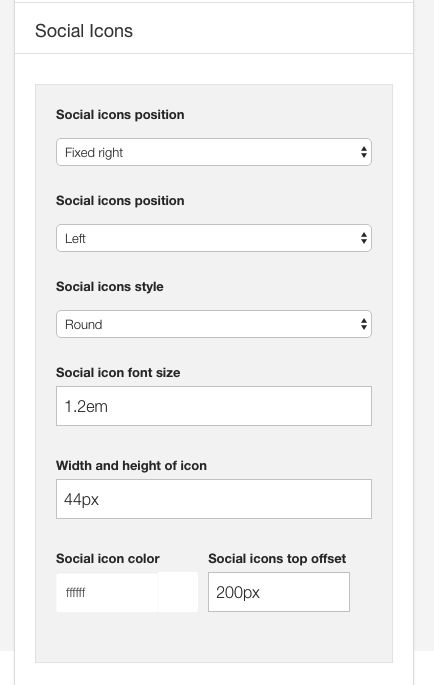

The behaviour for the social icons is configured via the social panel in the template settings.

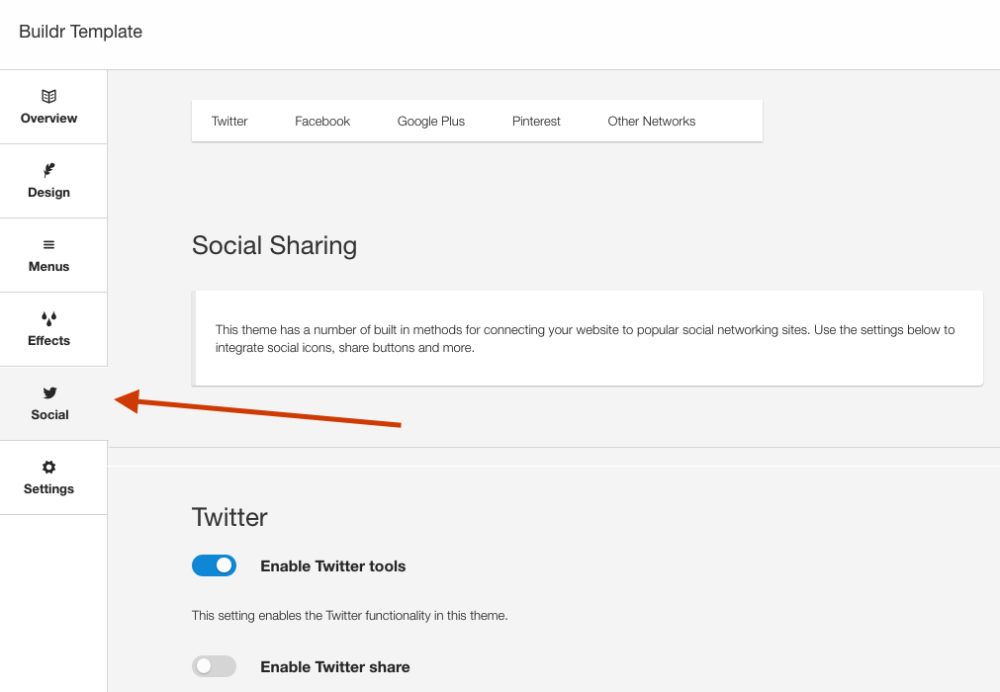

## Social Icon responsive control
The social icon block is set to be hidden on phone devices and the social mobile icons are set to display on phone devices.

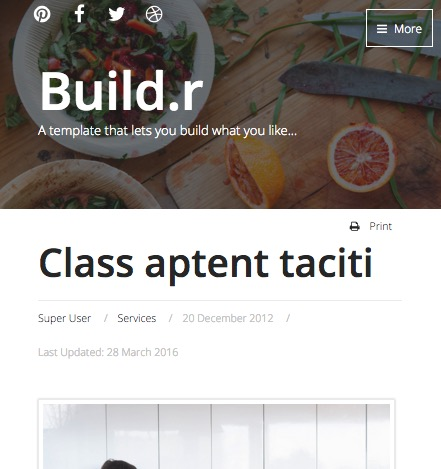

### Debug row hidden on phone devices
The social icons seen on tablet and desktop sizes are hidden on phone screens.

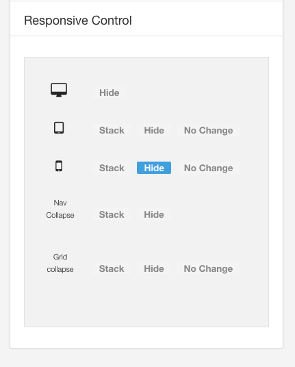

### Social mobile block position on the Top left

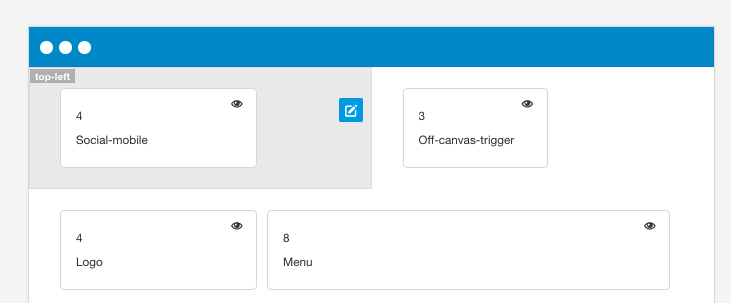

### Social mobile hidden on desktop and tablets, visible on phones

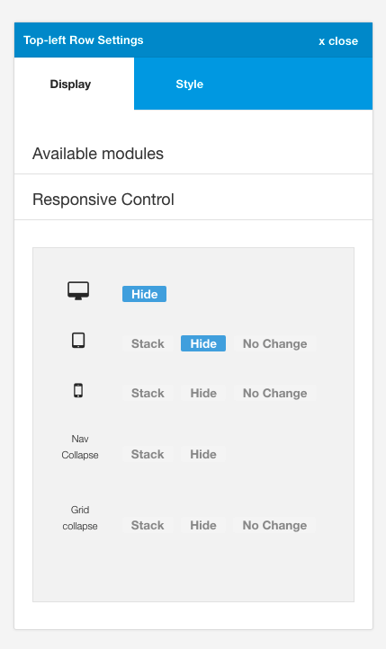

