The Responsive theme uses the Writer preset. To apply the Responsive preset follow the instruction on the <a href="../recreating-the-demo">recreating the demo page</a> and select the preset for the Responsive theme.

The Responsive theme is a replica of the original Responsive template first release don the Zen Grid Framework v2.

## Description of elements

## Top right menu

This is a core Joomla menu published to the top4 menu position.

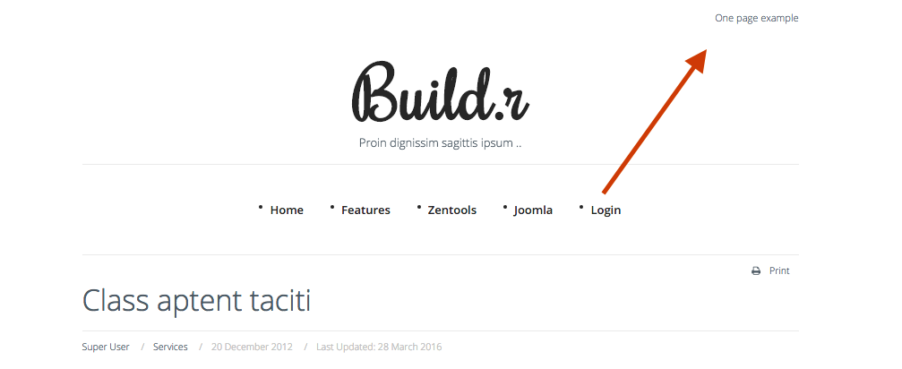

## Logo

This is a custom html module published to the logo position.

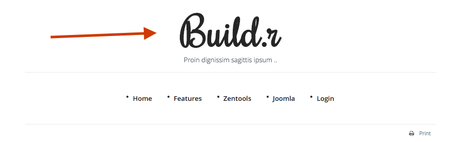

The font used for the logo is Rochester.

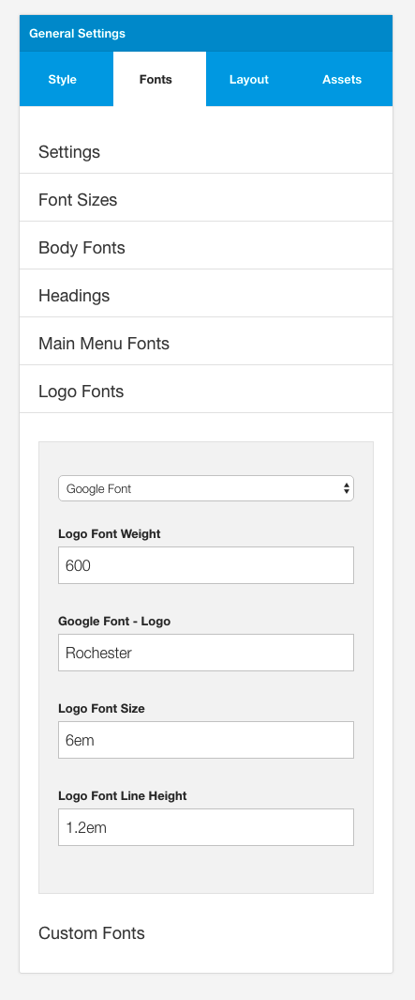

The row uses the No Margin setting so that there are no extra margins applied to the logo module.

## Menu

This is a core Joomla menu module published to the menu position.

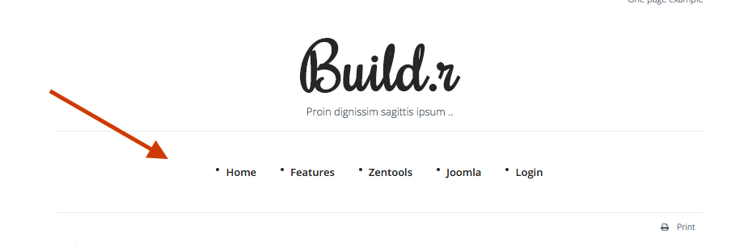

The colors used in the menu are controlled in the general setting sidepanel under the menu and Menu dropdown panels.

The height of the menu is controlled by the navbar height setting.

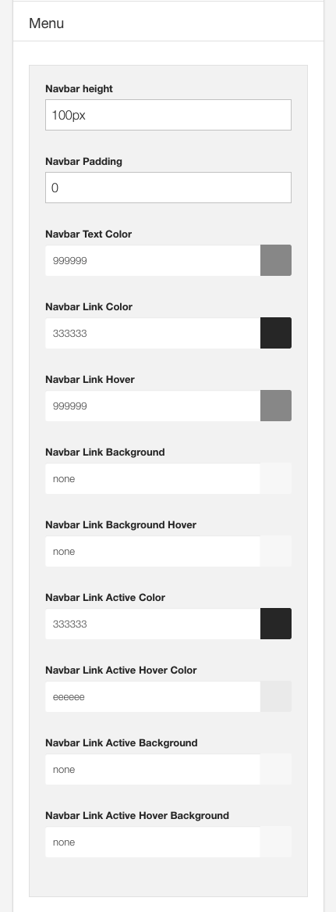

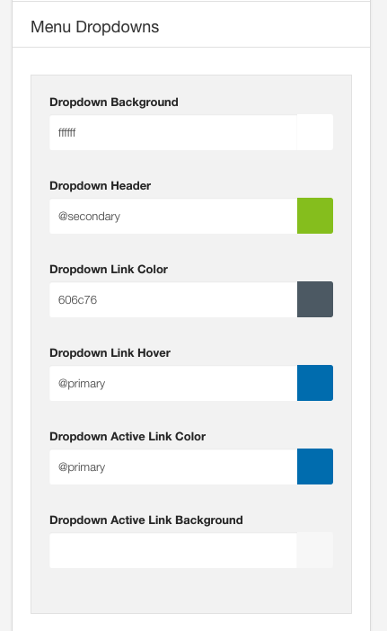

## Article

This is an article referenced from the Joomla content.

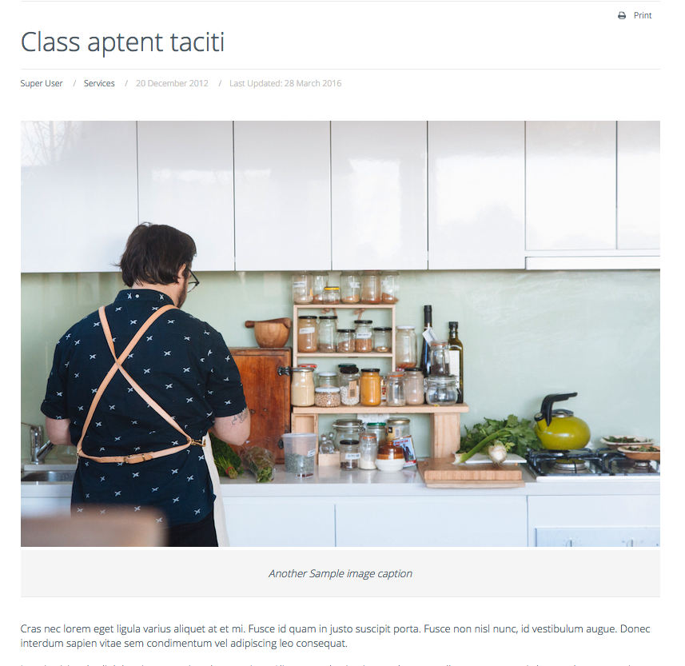

The Joomla component is rendered by added the maincontent block to the main row.

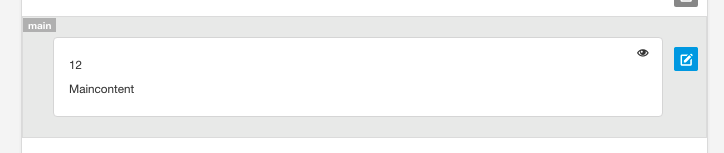

The main row uses the vertical padding style.

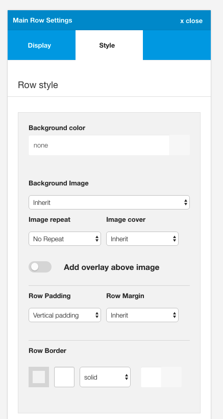

The main container has a bottom border applied to it.

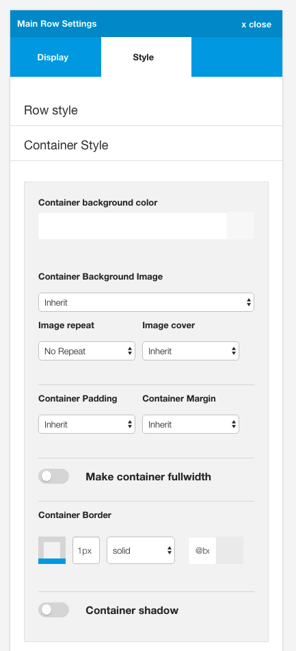

## Bottom modules

The bottom modules are a collection of custom html modules.

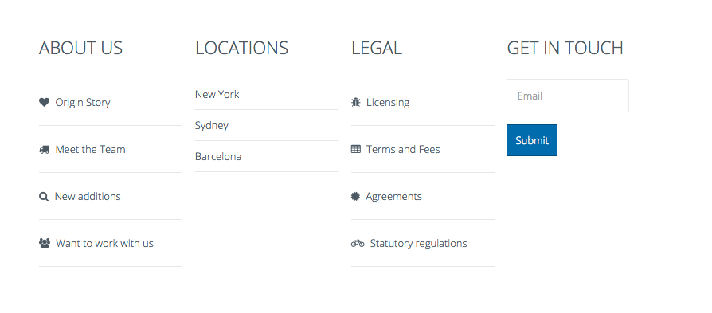

The bottom row uses the container padding styling.

### About Us module
Published to the bottom1 position.
Uses Zen Shortcode syntax to render the icons

**Markup Used**

Note the use of the zen classes on the list:

- zen-nav to reference the Zen Grid Framework nav class
- zen-nav-stacked renders a vertical list
- zen-lines renders lines underneath the list items

		<ul class="zen-nav zen-nav-stacked zen-lines">
		<li><a href="http://www.joomlabamboo.com">{zen-heart}{/zen-heart} Origin Story</a></li>
		<li><a href="http://www.joomlabamboo.com">{zen-truck}{/zen-truck} Meet the Team</a></li>
		<li><a href="http://www.joomlabamboo.com">{zen-search}{/zen-search} New additions</a></li>
		<li><a href="http://www.joomlabamboo.com">{zen-users}{/zen-users} Want to work with us</a></li>
		</ul>

### Locations module
Published to the bottom2 position.

**Markup Used**

Note the use of the zen classes on the list:

- zen-nav to reference the Zen Grid Framework nav class
- zen-nav-stacked renders a vertical list
- zen-lines renders lines underneath the list items

		<ul class="zen-nav zen-nav-stacked zen-lines">
		<li>New York</li>
		<li>Sydney</li>
		<li>Barcelona</li>
		</ul>

### Legal
Published to the bottom3 position.

**Markup Used**

Note the use of the zen classes on the list:

- zen-nav to reference the Zen Grid Framework nav class
- zen-nav-stacked renders a vertical list
- zen-lines renders lines underneath the list items

		<ul class="zen-nav zen-nav-stacked zen-lines">
		<li><a href="http://www.joomlabamboo.com">{zen-bug}{/zen-bug} Licensing</a></li>
		<li><a href="http://www.joomlabamboo.com">{zen-table}{/zen-table} Terms and Fees</a></li>
		<li><a href="http://www.joomlabamboo.com">{zen-certificate}{/zen-certificate} Agreements</a></li>
		<li><a href="http://www.joomlabamboo.com">{zen-bicycle}{/zen-bicycle} Statutory regulations</a></li>
		</ul>

### Get in touch module

This is a html content module containing dummy content. There is no functionality attached to this input.

		
<input type="text" placeholder="Email" /><button class="btn">Submit</button>

## Footer area

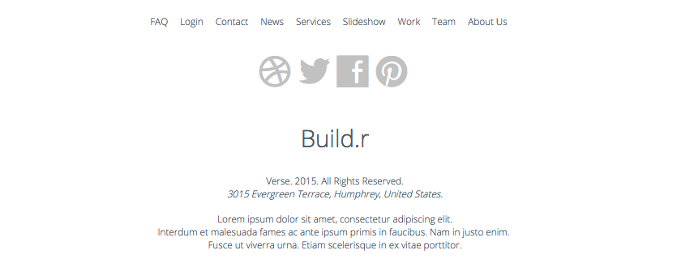

- Footer Menu: Joomla menu published to the footer position
- Footer Social Icons: Zensocial module published to the footer position
- Footer logo and text: Custom html module published to the footer position

## Responsive menu

The menu displayed on small screens for this theme is the select menu.

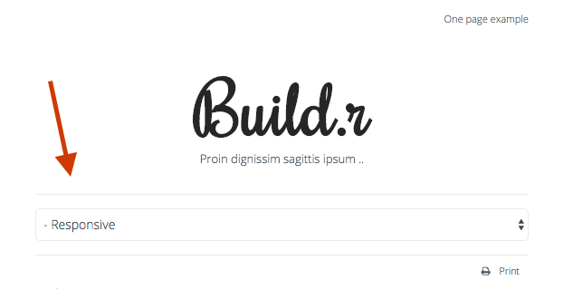

The menu type is set under the layout tab in the General settings side panel.

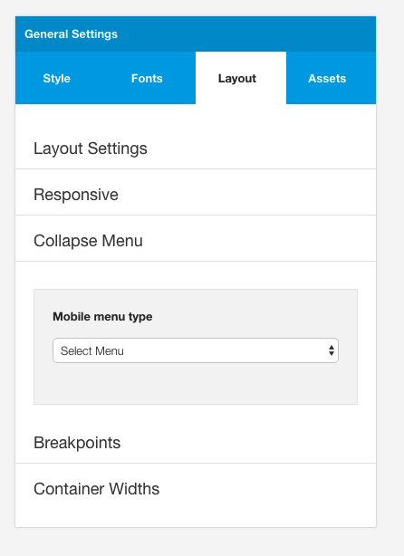