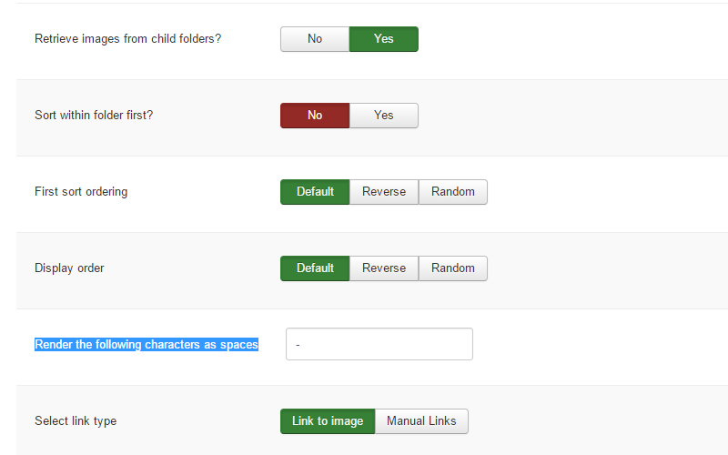

The Standard preset is a replica of the original Standard template - a Sept 2012 release using the Zen Grid Framework v2.

## Logo

This is a custom html module published to the logo position with the position assigned to the logowrap row.

### The font 

In the template settings select the design tab on the left and then cick the fonts tab in the right sidebar and then chose the logo fonts section. 

### Logo Font Color

In the template settings select the design tab on the left and then the style tab on the right sidebar. Click logo in right sidebar list and add the hex colour value e.g. #fff

### Logowrap padding

To add padding to the logowrap row click the pencil to the right of the logowrap row in the template settings and then click the style tab in the right sidebar. In the row style section scroll down to the Row Padding dropdown. 

### Banner

In the banner positon is a zentools2 module.

The zentools2 module is a zentools2 backstretch layout using the image folder source. The content set to display is an image and title (title is taken from the image file name as content source is a folder). 

THe banner content is set to Link Type as no link e.g. when image or title is clicked nothing happens.

The zentools2 contains module content navigation options.

The content source is images and is selected here.

For the title to display correcting the filename word separator needs to be set here.

### Banner styling

To add the background colour to the banner row click the pencil to the right of the banner row in the template settings. Click the style tab in the right sidebar and in Row style add a background colour value.

### Banner row padding

To add padding to the banner row click the pencil to the right of the banner row in the template settings and click the style tab in the right sidebar. In the row style section scroll down to the Row Padding dropdown.

### Grid 8

In Grid8 is a filtered zentools2 grid module set to display joomla content. To the left of the filtered grid8 position is grid5 which contains a custom html module with generic latin filler text.

The filtered module is set to display the content below from Joomla. The image and title content is set to link to the content.

The content is set to filter by category name and display in 3 columns - various other options are enabled in this panel.

The categories are selected and set to display 9 Joomla articles from the 3 categories.

The module itself has a class of no-margin to remove space between the grid5 and grid8 modules.

