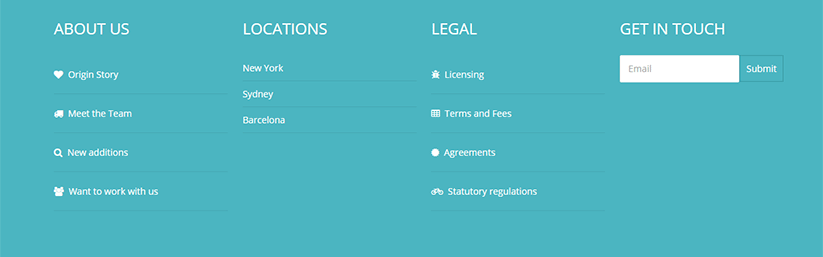
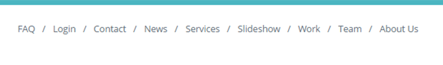

The Standard preset is a replica of the original Standard template - a Sept 2012 release using the Zen Grid Framework v2.

## Logo

This is a custom html module published to the logo position with the position assigned to the logowrap row.

### The font 

In the template settings select the design tab on the left and then cick the fonts tab in the right sidebar and then chose the logo fonts section. 

### Logo Font Color

In the template settings select the design tab on the left and then the style tab on the right sidebar. Click logo in right sidebar list and add the hex colour value e.g. #fff

### Logowrap padding

To add padding to the logowrap row click the pencil to the right of the logowrap row in the template settings and then click the style tab in the right sidebar. In the row style section scroll down to the Row Padding dropdown. 

### Banner

In the banner positon is a zentools2 module.

The zentools2 module is a zentools2 backstretch layout using the image folder source. The content set to display is an image and title (title is taken from the image file name as content source is a folder). 

THe banner content is set to Link Type as no link e.g. when image or title is clicked nothing happens.

The zentools2 contains module content navigation options.

The content source is images and is selected here.

For the title to display correcting the filename word separator needs to be set here.

### Banner styling

To add the background colour to the banner row click the pencil to the right of the banner row in the template settings. Click the style tab in the right sidebar and in Row style add a background colour value.

### Banner row padding

To add padding to the banner row click the pencil to the right of the banner row in the template settings and click the style tab in the right sidebar. In the row style section scroll down to the Row Padding dropdown.

### Grid 8

In Grid8 is a filtered zentools2 grid module set to display joomla content. To the left of the filtered grid8 position is grid5 which contains a custom html module with generic latin filler text.

The filtered module is set to display these content elements from Joomla. The image and title content is set to link to the content.

The content is set to filter by category name and display in 3 columns - various other options are enabled in this panel.

The categories are selected and set to display 9 Joomla articles from the 3 categories.

The module itself has a class of no-margin to remove space between the grid5 and grid8 modules.

### Breadcrumbs and Main Content 

In the abovecontent position is a Joomla core breadcrumbs module - this position means it is above the Mainwraprow (article / component content area).

The main area consists of the maincontent position alongside the sidebar2 position with mainwrap vertical row padding.

### Sidebar2

In the sidebar2 position is a zentools2 module. This is a list taking image, title and intro text content from Joomla articles inside the meet the team category. The image and title are set to link to content.

### Grid6wrap Grid 21 and Grid 24 position modules

Below the content area is gridwrap6 which contains two positions grid21 and grid24.

Both modules are skillset modules.

*Grid21*

This module uses the circular option.

The styling options are in the advanced tab of the module.

*Grid24*

This module uses the skills option.

### Bottom Row

This is 4 module positions. - Bottom1, Bottom2, Bottom3 and Bottom4. All are custom html modules - the 3 html lists used use zen-nav zen-nav-stacked zen-lines to display the lines under the li elements.

Padding is assigned to the container - e.g. which means added space inside the template width to the left, top, right and bottom of the row content.

### Footer content

The first footer module is a joomla core menu module. Inside the advanced tab of the menu module in the menu class suffix has these classes added - zen-nav zen-center. To add a divider between menu elements add another class zen-nav-divider to the existing two classes.

Footer social icons are added by a zensocial module published to the footer position.

The alignment is controlled by the module - colours, icons, links to social media in this position need to be added in the module itself.

Footer text and logo are added via a custom html module

Inline styling is adding to center the text and footer logo.

### Social Media

To the right of page are the social media icons controlled by the social tab of the template settings.

The social position for the module is added to the debug row.

How the social media are styling is controlled via the design tab on the left and then scrolling down the General Settings on the right sidebar.

