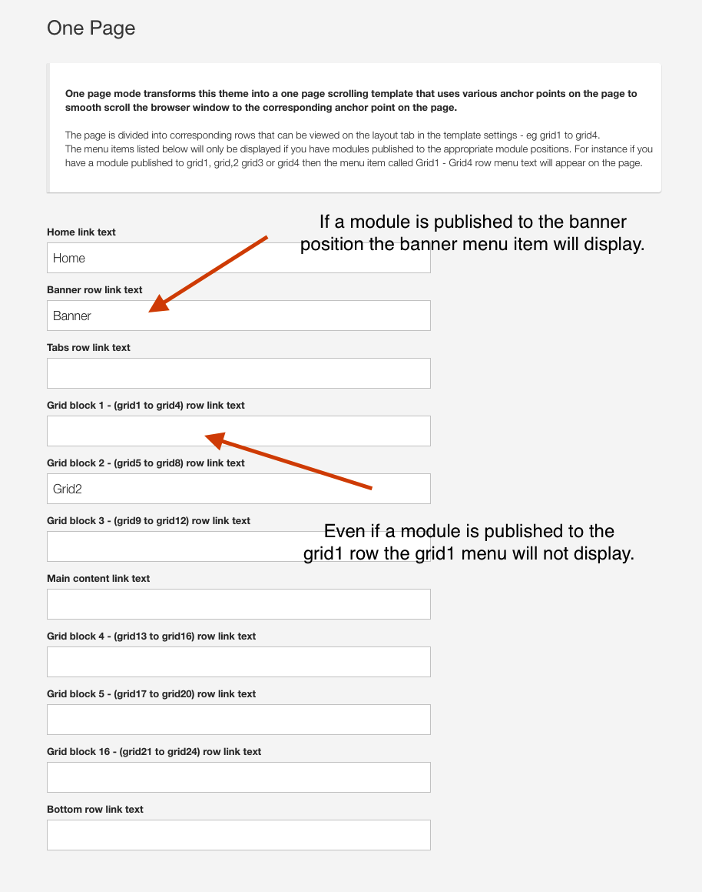

### (Article in progress)
This article is incomplete and will be updated shortly.

The Rows template is a one page design that showcases the Build.r functionality of being able to display an image underneath the content across multiple rows on the page.

## Logo

Custom html module published to the logo position.

## Social Icons

Social icon block generated by the template.

### The Position of the social icons are controlled in the templates layout tool.

### The display of the social icons is controlled in the general settings sidepanel

## Offcanvas trigger

Offcanvas trigger generated by the template.

### Offcanvas Position

The offcanvas trigger is positioned in the template via the layout tool.

### Offcanvas Settings

Features such as the button style for the offcanvas trigger, the side of the screen the offcanvas opens on, when it becomes visible and the text for the trigger are controlled in the menus > offcanvas panel of the template.

### Offcanvas button color

The color of the offcanvas button is controlled in the row settings panel for the top-right position. The btn-empty style inherits the color set in the colors section of the top-right row settings panel.

## Menu

The menu is an instance of the Onepage menu layout block. 

### The block is displayed in the logo row.

### One page menu links

The menu is automatically created when you add a module to a specific position **and** the menu title for that position is not blank in your template settings. 

## 4 rows of content with dummy text and image underneath

The four rows of content that use the rows of colour with the image underneath are an example of applying images to rows via the row settings and applying a transparent overlay to the row.

The content is derived from a custom html module published to the following positions:

- banner
- grid1
- grid13
- grid17

### Background image
The image for each row is set in the row settings for the corresponding row.

### Overlay colour
The overlay colour is referenced from the colour assigned to the background for each row.

### Transparency of overlay
The % transparency is referenced from the Overlay fade setting (%) found in the general settings panel under the Background Overlay accordion.

### Module class suffix's applied to modules
The modules published to each position use the following module classes:

- zen-padding (applies padding equal to the vertical and horizontal gutter values)
- top100 (applies a top margin of 100px) 
- bottom100 (applies a bottom margin of 100px)

### Row class
Each row is given a no-margin row class which ensures that:

- the modules do not add any extra margins to the modules
- There is no extra space in between the rows so that the rows stack neatly on top of one another. 

## Theme Overview and By the Numbers module
These two modules are instances of the Skillset module.

Skillset provides the ability to display numbers and percentages in three different ways. The Buildr template shows the circular and the bar layout. The additional layout is the count down layout.

The module is published to the following positions:

- grid21
- grid24

### Row padding

The row is assigned a vertical padding class.

## Bottom modules

The bottom modules are a collection of custom html modules.

### About Us module
Published to the bottom1 position.
Uses Zen Shortcode syntax to render the icons

**Markup Used**

Note the use of the zen classes on the list:

- zen-nav to reference the Zen Grid Framework nav class
- zen-nav-stacked renders a vertical list
- zen-lines renders lines underneath the list items

		<ul class="zen-nav zen-nav-stacked zen-lines">
		<li><a href="http://www.joomlabamboo.com">{zen-heart}{/zen-heart} Origin Story</a></li>
		<li><a href="http://www.joomlabamboo.com">{zen-truck}{/zen-truck} Meet the Team</a></li>
		<li><a href="http://www.joomlabamboo.com">{zen-search}{/zen-search} New additions</a></li>
		<li><a href="http://www.joomlabamboo.com">{zen-users}{/zen-users} Want to work with us</a></li>
		</ul>

### Locations module
Published to the bottom2 position.

**Markup Used**

Note the use of the zen classes on the list:

- zen-nav to reference the Zen Grid Framework nav class
- zen-nav-stacked renders a vertical list
- zen-lines renders lines underneath the list items

		<ul class="zen-nav zen-nav-stacked zen-lines">
		<li>New York</li>
		<li>Sydney</li>
		<li>Barcelona</li>
		</ul>

### Legal
Published to the bottom3 position.

**Markup Used**

Note the use of the zen classes on the list:

- zen-nav to reference the Zen Grid Framework nav class
- zen-nav-stacked renders a vertical list
- zen-lines renders lines underneath the list items

		<ul class="zen-nav zen-nav-stacked zen-lines">
		<li><a href="http://www.joomlabamboo.com">{zen-bug}{/zen-bug} Licensing</a></li>
		<li><a href="http://www.joomlabamboo.com">{zen-table}{/zen-table} Terms and Fees</a></li>
		<li><a href="http://www.joomlabamboo.com">{zen-certificate}{/zen-certificate} Agreements</a></li>
		<li><a href="http://www.joomlabamboo.com">{zen-bicycle}{/zen-bicycle} Statutory regulations</a></li>
		</ul>

### Get in touch module

This is a html content module containing dummy content. There is no functionality attached to this input.

		
<input type="text" placeholder="Email" /><button class="btn">Submit</button>

## Footer Menu

Joomla menu published to the footer position

## Footer Social Icons

Zensocial module published to the footer position

## Footer logo and text

Custom html module published to the footer position

## Offcanvas accordion menu (Small screens)

The menu in the offcanvas position is automatically rendered from the menu module. 

The Offcanvas menu is set to display on the screen and at all screensizes because of the following criteria.

**Collapse menu set to display offcanvas**
The collapse menu type is set to use the Offcanvas panel.

## Recent News Module
The recent news module is an instance of the Zentools2 module displaying Joomla content using the list layout.

### Zentools2 Settings

**Module**

**Options**

**Content**
